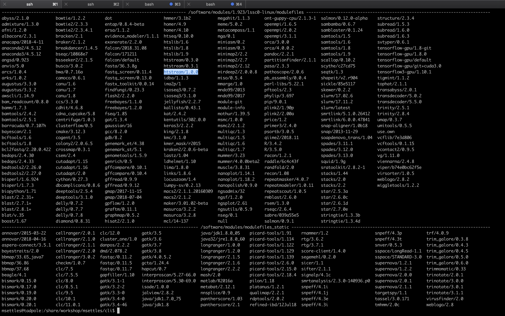

# Running jobs on the cluster and using modules

**1\.** In the UC Davis Bioinformatics Core we have a large computational cluster (named lssc0) that we use for our analyses. The job scheduling system we use on this cluster is called [Slurm](https://slurm.schedmd.com/). In this section, we will go through examples of the commands we will be using to interact with the cluster.

First, what is a cluster?


The basic architecture of a compute cluster consists of a "head node", which is the computer from which a user submits jobs to run, and "compute nodes", which are a large number of computers on which the jobs can be run. It is also possible to log into a compute node and run jobs directly from there. **In general you should never run a job directly on the head node!**

---
**2\.** Now, let's look at a few slurm commands.

First, log into the head node (tadpole.genomecenter.ucdavis.edu). The main commands we will be using are srun, sbatch, squeue, scancel, and sacct.

Lets make sure we are where we are supposed to be and that the References directory is available.

    cd /share/workshop/$USER/cli

**2a\.** ['srun'](https://slurm.schedmd.com/srun.html) is used to run a job interactively. We most often use it to start an interactive session on a compute node. Take a look at the options to srun:

    srun --help

Our cluster requires that you specify a time limit for your job. If your job exceeds these limits, then it will be killed. So try running the following to create an interactive session on a node:

    srun -t 00:30:00 -c 4 -n 1 --mem 2000 --account workshop --reservation workshop --pty /bin/bash

This command is requesting a compute node with a time limit of 30 minutes (-t), one processor (-c), a max memory of 2Gb [2000] (--mem), using a compute account and reservation for this workshop (an option you would not normally use), and then finally, specifying a shell to run in a terminal ("--pty" option). Run this command to get to a compute node when you want to run jobs on the command-line directly.

```
msettles@tadpole:~$srun -t 00:30:00 -c 4 -n 1 --mem 2000 --account workshop --reservation workshop --pty /bin/bash
srun: job 29390113 queued and waiting for resources
srun: job 29390113 has been allocated resources
groups: cannot find name for group ID 2020
bash: /home/msettles/.bashrc: Permission denied
msettles@drove-13:~$
```

You safely ignore the working and error. Notice that we are no longer on tadpole, but are now on drove-13, one of our compute nodes.

use Exit on the command line to exit the session

    exit

---
**2b\.** ['sbatch'](https://slurm.schedmd.com/sbatch.html) is used to submit jobs to run on the cluster. Typically it is used to run many jobs via the scheduler non-interactively. Look at the options for sbatch:

    sbatch --help

Generally, we do not use any options for sbatch ... we typically give it a script (i.e. a text file with commands inside) to run. Let's take a look at a template script [template.slurm](templates/template.slurm):

```
#!/bin/bash

# options for sbatch
#SBATCH --job-name=name # Job name
#SBATCH --nodes=1 # should never be anything other than 1
#SBATCH --ntasks=1 # number of cpus to use
#SBATCH --time=60 # Acceptable time formats include "minutes", "minutes:seconds", "hours:minutes:seconds", "days-hours", "days-hours:minutes" and "days-hours:minutes:seconds".
#SBATCH --mem=2000 # Memory pool for all cores (see also --mem-per-cpu)
#SBATCH --partition=production # cluster partition
#SBATCH --reservation=workshop # cluster reservation
#SBATCH --account=workshop # cluster account to use for the job
##SBATCH --array=1-16 # Task array indexing, see https://slurm.schedmd.com/job_array.html, the double # means this line is commented out
#SBATCH --output=stdout.out # File to which STDOUT will be written
#SBATCH --error=stderr.err # File to which STDERR will be written
#SBATCH --mail-type=ALL
#SBATCH --mail-user=myemail@email.com

# for calculating the amount of time the job takes and echo the hostname
begin=`date +%s`
echo $HOSTNAME

# Sleep for 60 seconds
sleep 300

# getting end time to calculate time elapsed
end=`date +%s`
elapsed=`expr $end - $begin`
echo Time taken: $elapsed
```

The first line tells sbatch what scripting language (bash here) the rest of the file is in. Any line that begins with a "#" symbol is ignored by the bash interpreter, those lines that begin with "#SBATCH" are used by the slurm controller. Those lines are for specifying sbatch options without having to type them on the command-line every time. In this script, on the next set of lines, we've put some code for calculating the time elapsed for the job and then we simply wait for 5 minutes (300 seconds) and exit. Lets try running it


    cd /share/workshop/$USER/cli
    wget https://raw.githubusercontent.com/ucdavis-bioinformatics-training/2019_March_UCSF_mRNAseq_Workshop/master/cli/templates/template.slurm
    cat template.slurm
    sbatch template.slurm

The non slurm version is the [template.sh](templates/template.sh) script. You'll notice it looks the same only missing the #SBATCH commands.

After finishing you will see two new files in the directory stdout.out and stderr.err where stdout and stderr (respectively) were redirected to.

---
**2c\.** ['squeue'](https://slurm.schedmd.com/squeue.html) is to list your currently queued/running jobs. T

    squeue --help

Looking at the help documentation, we see that we can filter the results based on a number of criteria. The most useful option is "-u", which you can use to see just the jobs for a particular user ID. The first column gives you the job ID of the job, the second is the partition (different queues for different types of machines), the name of the job, the user who ran the job, the state of the job (R is for running), the length of time the job has been running, the number of nodes the job is using, and finally, the node name where the job is running or a reason why the job is waiting.

    squeue -u username

```
msettles@tadpole:/share/workshop/msettles/cli$ squeue -u msettles
             JOBID PARTITION     NAME     USER ST       TIME  NODES NODELIST(REASON)
          29390121 productio     name msettles  R       0:06      1 drove-13
```

You can see the job has been running (ST=R) for 6 seconds (TIME=0:06) on node drove-12. The jobid (here 29390121) can be used to cancel the job later, or get additional job information.

**2d\.** 'scancel' command is used to cancel jobs (either running or in queue).

You can give it a job ID, or if you use the "-u" option with your username, you can cancel all of your jobs at once.

    scancel -j 29390121

will cancel the above job if its still running.

**2e\.** 'sacct' command is used to get accounting data for any job that has ever run, using the job ID.

To get statistics on completed jobs by jobID (replace jobid with your jobid):

    sacct -j jobid --format=JobID,JobName,MaxRSS,Elapsed

To view the same information for all jobs of a user (replace username with your username):

    sacct -u username --format=JobID,JobName,MaxRSS,Elapsed


**You can get more information about each command by typing "<command> --help" or by looking at [this summary page](https://slurm.schedmd.com/pdfs/summary.pdf).**

---
## Environment modules

**1\.** The 'module' command and its sub-commands. You will NOT find the 'module' command on all linux computers. Using modules is generally something that is used on a shared system (like clusters) and generally installed by the system's administrator. The module system allows to only 'load' software when needed as well as to make multiple versions of software available at the same time. It basically changes your PATH variable (and possibly other environment variables) so that the shell searches the correct directories for the software you want to use. First, take a look at all the software available on our system:

    module avail



This is a list of all the software (with different versions) that you can access. The format of 'modules' is software/version here you can see htstream has 3 different versions installed with the latest being 1.0.0. When you load a module without specifying a version, it will load the default (generally the latest) version. If you need an older version, you need to use the cooresponding version number:

Now try running the 'hts_Stats' app from htstream:

    hts_Stats

```
msettles@tadpole:/share/workshop/msettles/cli$hts_Stats
-bash: hts_Stats: command not found
```

You should get an error saying that the command was not found. Take a look at your PATH variable.

    echo $PATH

```
msettles@tadpole:/share/workshop/msettles/cli$ echo $PATH
/software/slurm/17.11.2/lssc0-linux/sbin:/software/slurm/17.11.2/lssc0-linux/bin:/software/modules/1.923/lssc0-linux/bin:/usr/local/sbin:/usr/local/bin:/usr/sbin:/usr/bin:/sbin:/bin:/usr/games:/usr/local/games:/snap/bin:/opt/puppetlabs/bin
```
These are the directories (colon separated) that are searched for executable applications to run on the command-line. In order to access a piece of software that is not in one of these default directories, we need to use the 'module load' command, or set the PATH to locate it:

    module load htstream/1.0.0
    hts_Stats

Use the 'which' command to find out where the 'hts_Stats' command is actually located:

    which hts_Stats

You'll see that hts_Stats is located in a completely different place and yet you are able to access it. This is because the module command changes your PATH variable so that it has the correct directory. Take a look at your PATH again:

    echo $PATH

You'll see that the directory for scythe has been added to PATH.

---
**2\.** A few more module sub-commands that are useful:

'module list' will list all of your currently loaded modules in this terminal/session.

    module list

```
msettles@tadpole:/share/workshop/msettles/cli$ module list
Currently Loaded Modulefiles:
 1) slurm/latest   2) htstream/1.0.0
```
'module unload' will unload the module(s) you specify.

    module load star
    module load samtools
    module list
    module unload star
    module list

```
msettles@tadpole:/share/workshop/msettles/cli$ module load star
Module star-2.7.0e-lssc0-linux loaded. STAR (Spliced Transcripts Alignment to a Reference) is an RNA-seq data aligner. NOTE: Indices must be indexed using this version or newer, they cannot be from a previous version.
msettles@tadpole:/share/workshop/msettles/cli$ module load samtools
Module samtools-1.9-lssc0-linux loaded. Samtools is a suite of programs for interacting with high-throughput sequencing data.
msettles@tadpole:/share/workshop/msettles/cli$ module list
Currently Loaded Modulefiles:
 1) slurm/latest   2) htstream/1.0.0   3) star/2.7.0e   4) samtools/1.9
msettles@tadpole:/share/workshop/msettles/cli$ module unload star
msettles@tadpole:/share/workshop/msettles/cli$ module list
Currently Loaded Modulefiles:
 1) slurm/latest   2) htstream/1.0.0   3) samtools/1.9
```

'module purge' will unload all of your modules. Which simply means that it will take out the directories for all of the modules from your PATH variable. Take a look at $PATH now:

    echo $PATH
    module purge
    module list
    echo $PATH

```
msettles@tadpole:/share/workshop/msettles/cli$     echo $PATH
/software/samtools/1.9/lssc0-linux/bin:/software/htstream/1.0.0/lssc0-linux/bin:/share/biocore/software/bin:/software/modules/1.923/lssc0-linux/bin:/usr/local/sbin:/usr/local/bin:/usr/sbin:/usr/bin:/sbin:/bin:/usr/games:/usr/local/games:/snap/bin:/opt/puppetlabs/bin
msettles@tadpole:/share/workshop/msettles/cli$     module purge
msettles@tadpole:/share/workshop/msettles/cli$     module list
No Modulefiles Currently Loaded.
msettles@tadpole:/share/workshop/msettles/cli$     echo $PATH
/share/biocore/software/bin:/software/modules/1.923/lssc0-linux/bin:/usr/local/sbin:/usr/local/bin:/usr/sbin:/usr/bin:/sbin:/bin:/usr/games:/usr/local/games:/snap/bin:/opt/puppetlabs/bin
```
