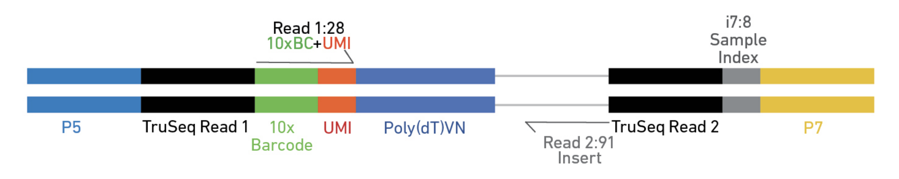
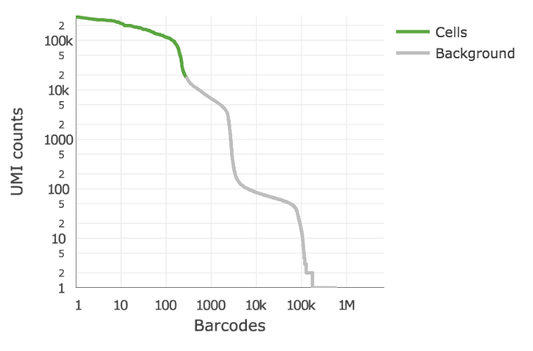
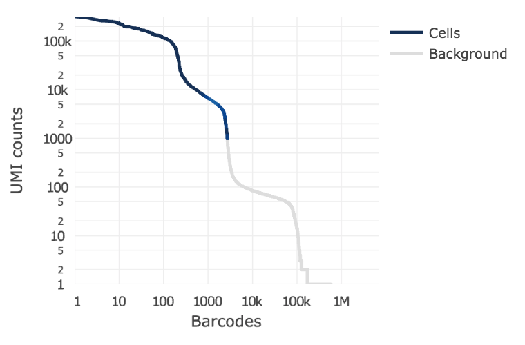

# Generating a Gene Expression Matrix

Most analyses have two stages: data reduction and biological analysis.
Statistical analyses of scRNA-seq data take as their starting point an __expression matrix__, where each row represents a gene and each column represents a sample (in scRNAseq a cell). Each entry in the matrix represents the number of reads (expression level) of a particular gene in a given sample (cell). In most cases the number of unique reads (post umi filtering) assigned to that gene in that sample/cell. Generating the expression matrix often involves some, or all, of the following.

<div class="figure" style="text-align: center">

<p class="caption">Flowchart of scRNAseq analysis</p>
</div>

### Preprocessing and mapping reads

Raw fastq files first need to be preprocessed, extracting any elements that are a part of the sequence read.

* Library Barcode (library Index) - Used to pool multiple libraries on one sequencing lane
* Cell Barcode (10x Barcode) – Used to identify the cell the read came from
* Unique Molecular Index (UMI) – Used to identify reads that arise during PCR replication
* Sequencing Read – Used to identify the gene a read came from

The remaining sequences are mapped to a reference genome. We tend to use the [STAR](https://github.com/alexdobin/STAR) aligner. For large full-transcript datasets from well annotated organisms (e.g. mouse, human) pseudo-alignment methods (e.g. [Kallisto](https://pachterlab.github.io/kallisto/), [Salmon](http://salmon.readthedocs.io/en/latest/salmon.html)) are also a good choice for alignment. For __full-length__ datasets with tens- or hundreds of thousands of reads per cell pseudo-aligners become more appealing since their run-time can be several orders of magnitude less than traditional aligners.

__Note__, if _spike-ins_ are used, the _spike-in_ sequences should be added to the reference sequence prior to mapping.

### Mapping QC

After aligning sequence data to the genome we should evaluate the quality of the mapping. There are many ways to measure the mapping quality, including: percentage mapped, amount of reads which map to rRNA/tRNAs, proportion of uniquely mapped reads, reads mapping across splice junctions, read depth along the transcripts, etc. Methods developed for bulk RNAseq, such as [RSeQC](http://rseqc.sourceforge.net/) and [samtools](http://samtools.github.io/), are applicable to single-cell data:

### Gene Counting

STAR, Kallisto, and Salmon all quantify the expression level of each gene for
each cell as a part of its output. If UMIs were used, duplicates need to be first marked and then gene expression levels recounted. The packages (`UMI-tools`)[https://github.com/CGATOxford/UMI-tools) can be used to process and correct UMIs.


Specific steps to be performed are dependent on the type of library, the element layout of the read, and the sequencing parameters.

## scRNAseq Libraries

Generating scRNAseq libraries is currently an active area of research with several protocols being published in the last few years, including:

* CEL-seq Hashimshony, 2012
* CEL-seq2 Hashimshony, 2016
* DroNC-seq Habib, 2017
* Drop-seq Macosko, 2015
* InDrop-seq Klein, 2015
* MATQ-seq Sheng, 2017_2018
* MARS-seq Jaitin, 2014
* SCRB-seq Soumillon, 2014
* Seq-well Gierahn, 2017
* Smart-seq Picelli, 2014
* Smart-seq2 Picelli, 2014
* SMARTer [clontech](http://www.clontech.com/US/Products/cDNA_Synthesis_and_Library_Construction/Next_Gen_Sequencing_Kits/Total_RNA-Seq/Universal_RNA_Seq_Random_Primed)
* STRT-seq Islam, 2014

Differences between the methods are are in how they capture and quantify gene expression (either __full-length__ or __tag-based__).

__Full-length__ capture tries to achieve a uniform coverage of each transcript (many reads per transcript). __Tag-based__ protocols only capture either the 5'- or 3'-end of each tran script (single read per transcript). Choice in method determines what types of analyses the data can be used for. __Full-length__ capture can be used to distinguish different iso-forms, where __tag-based__ method is best used for only gene abundance.

* __Tag-based__ 3’ counting techniques
	* 1 read per transcript
	* Based on polyA
	* Expression analysis only
	* Fewer reads per cell needed neede (~20K reads/cell 10x V3)
	* Less noise in expression patterns
* __Full-length__
	* Based on polyA
	* Expression analysis
	*  Splicing information
	*  The more information desired beyond expression, the higher the reads needed per cell (~50K reads/cell to 10M reads/cell)


For smaller experiments < 5000 cells, the R packages [`SingleCellExperiment`](http://bioconductor.org/packages/SingleCellExperiment), [`scater`](http://bioconductor.org/packages/scater/), [`SC3`](http://bioconductor.org/packages/release/bioc/html/SC3.html) are good choices. For larger experiments (> 5000 cells), the R package [`Seurat`](http://satijalab.org/seurat/) offers a complete solution.

A nice page keeping track of single-cell software can be found [here](https://github.com/seandavi/awesome-single-cell).

## 10X Genomics generation of expression matrix with cellranger

[cellranger](https://support.10xgenomics.com/single-cell-gene-expression/software/pipelines/latest/what-is-cell-ranger)

10X Genomics cellranger uses the [STAR](https://github.com/alexdobin/STAR) aligner to map reads to a genome after first preprocessing them (extracting cell and UMI sequences).

<div class="figure" style="text-align: center">

<p class="caption">Elements to a 10x read (V3)</p>
</div>

cellranger  version 3 has many sub-applications

1. cellranger mkfastq  

2. cellranger count  
3. cellranger aggr  
4. cellranger reanalyze  
5. cellranger mat2csv  

6. cellranger mkgtf  
7. cellranger mkref  

8. cellranger vdj  

9. cellranger mkvdjref  

10. cellranger testrun  
11. cellranger upload  
12. cellranger sitecheck  

### Cell barcode and UMI filtering

* Cell barcodes
	* Must be on static list of known cell barcode sequences
	* May be 1 mismatch away from the list if the mismatch occurs at a low- quality position (the barcode is then corrected).

* UMIs (Unique Molecular Index)
	* Must not be a homopolymer, e.g. AAAAAAAAAA
	* Must not contain N
	* Must not contain bases with base quality < 10
	*	UMIs that are 1 mismatch away from a higher-count UMI are corrected to that UMI if they share a cell barcode and gene.


### Alignment

#### Genome Alignment
cellranger uses an aligner called STAR, which performs splicing-aware alignment of reads to the genome. cellranger uses the transcript annotation GTF to bucket the reads into exonic, intronic, and intergenic, and by whether the reads align (confidently) to the genome. A read is exonic if at least 50% of it intersects an exon, intronic if it is non-exonic and intersects an intron, and intergenic otherwise.

#### MAPQ adjustment
For reads that align to a single exonic locus but also align to 1 or more non-exonic loci, the exonic locus is prioritized and the read is considered to be confidently mapped to the exonic locus with MAPQ 255.

#### Transcriptome Alignment
cellranger further aligns exonic reads to annotated transcripts, looking for compatibility. A read that is compatible with the exons of an annotated transcript, and aligned to the same strand, is considered mapped to the transcriptome. If the read is compatible with a single gene annotation, it is considered uniquely (confidently) mapped to the transcriptome. Only reads that are confidently mapped to the transcriptome are used for UMI counting.

### UMI Counting

* Using only the confidently mapped reads with valid barcodes and UMIs,
	* Correct the UMIs
		UMIs are corrected to more abundant UMIs that are one mismatch away in sequence (hamming distance = 1).
	* Record which reads are duplicates of the same RNA molecule (PCR duplicates)
	* Count only the unique UMIs as unique RNA molecules
	* These UMI counts form an unfiltered gene-barcode matrix.  


### Filtering cells (the 10x way)

cellranger 3.0 introduces and improved cell-calling algorithm that is better able to identify populations of low RNA content cells, especially when low RNA content cells are mixed into a population of high RNA content cells. For example, tumor samples often contain large tumor cells mixed with smaller tumor infiltrating lymphocytes (TIL) and researchers may be particularly interested in the TIL population. The new algorithm is based on the EmptyDrops method (Lun et al., 2018).

The algorithm has two key steps:

1. It uses a cutoff based on total UMI counts of each barcode to identify cells. This step identifies the primary mode of high RNA content cells.
2. Then the algorithm uses the RNA profile of each remaining barcode to determine if it is an “empty" or a cell containing partition. This second step captures low RNA content cells whose total UMI counts may be similar to empty GEMs.

In the first step, the original cellranger cell calling algorithm is used to identify the primary mode of high RNA content cells, using a cutoff based on the total UMI count for each barcode. cellranger takes as input the expected number of recovered cells, N (see --expect-cells). Let m be the 99th percentile of the top N barcodes by total UMI counts. All barcodes whose total UMI counts exceed m/10 are called as cells in the first pass.

In the second step, a set of barcodes with low UMI counts that likely represent ‘empty’ GEM partitions is selected. A model of the RNA profile of selected barcodes is created. This model, called the background model, is a multinomial distribution over genes. It uses Simple Good-Turing smoothing to provide a non-zero model estimate for genes that were not observed in the representative empty GEM set. Finally, the RNA profile of each barcode not called as a cell in the first step is compared to the background model. Barcodes whose RNA profile strongly disagrees with the background model are added to the set of positive cell calls. This second step identifies cells that are clearly distinguishable from the profile of empty GEMs, even though they may have much lower RNA content than the largest cells in the experiment.

Below is an example of a challenging cell-calling scenario where 300 high RNA content 293T cells are mixed with 2000 low RNA content PBMC cells. On the left is the cell calling result with the cell calling algorithm prior to cellranger 3.0 and on the right is the current cellranger 3.0 result. You can see that low RNA content cells are successfully identified by the new algorithm.

<p float="center">
  
  
</p>

### Matrix output

| Type			| Description |
|:----- 		|:------ |
| Raw	| gene-barcode matrices	Contains every barcode from fixed list of known-good barcode sequences. This includes background and non-cellular barcodes. |
| Filtered		| gene-barcode matrices	Contains only detected cellular barcodes. |

With 3 files needed to completely describe each gene x cell matrix

- matrix.mtx.gz
- features.tsv.gz
- barcode.tsv.gz

### Bam output

10x Chromium cellular and molecular barcode information for each read is stored as TAG fields:

| Tag	| Type	| Description
|:----- |:------ |:----- |
| CB	| Z		| Chromium cellular barcode sequence that is error-corrected and confirmed against a list of known-good barcode sequences. |
| CR	| Z		| Chromium cellular barcode sequence as reported by the sequencer. |
| CY	| Z		| Chromium cellular barcode read quality. Phred scores as reported by sequencer. |
| UB	| Z		| Chromium molecular barcode sequence that is error-corrected among other molecular barcodes with the same cellular barcode and gene alignment. |
| UR	| Z		| Chromium molecular barcode sequence as reported by the sequencer. |
| UY	| Z		| Chromium molecular barcode read quality. Phred scores as reported by sequencer. |
| BC	| Z		| Sample index read. |
| QT	| Z		| Sample index read quality. Phred scores as reported by sequencer. |
| TR	| Z		| Trimmed sequence. For the Single Cell 3' v1 chemistry, this is trailing sequence following the UMI on Read 2. For the Single Cell 3' v2 chemistry, this is trailing sequence following the cell and molecular barcodes on Read 1. |
| TQ	| Z		| Trimmed sequence quality. Phred scores as reported by the sequencer. No longer present in V3 |

The following TAG fields are present if a read maps to the genome __and__ overlaps an exon by at least one base pair. A read may align to multiple transcripts and genes, but it is only considered confidently mapped to the transcriptome it if mapped to a single gene.

| Tag	| Type	| Description
|:----- |:------ |:----- |
| TX	| Z		| Semicolon-separated list of transcripts that are compatible with this alignment. Transcripts are specified with the transcript_id key in the reference GTF attribute column. The format of each entry is [transcript_id],[strand][pos],[cigar], where strand is either + or -, pos is the alignment offset in transcript coordinates, and cigar is the CIGAR string in transcript coordinates. |
| AN	| Z		| Same as the TX tag, but for reads that are aligned to the antisense strand of annotated transcripts. V3 ONLY. |
| GX	| Z		| Semicolon-separated list of gene IDs that are compatible with this alignment. Gene IDs are specified with the gene_id key in the reference GTF attribute column. |
| GN	| Z		| Semicolon-separated list of gene names that are compatible with this alignment. Gene names are specified with gene_name key in the reference GTF attribute column. |
| MM	| i		| Set to 1 if the genome-aligner (STAR) originally gave a MAPQ < 255 (it multi-mapped to the genome) and cellranger changed it to 255 because the read overlapped exactly one gene. |
| RE	| A		| Single character indicating the region type of this alignment (E = exonic, N = intronic, I = intergenic). |

The following are feature barcoding TAG fields which are not aligned to the genome, but processed by the Feature Barcodng read processor. The BAM file will contain unaligned records for these reads, with the following tags representing the Feature Barcode sequence extracted from the read, and the feature reference it was matched to, if any. The BAM read sequence will contain all the bases outside of the cell barcode and UMI regions. V3 ONLY.

| Tag	| Type	| Description
|:----- |:------ |:----- |
| fb	| Z		| Chromium Feature Barcode sequence that is error-corrected and confirmed against known features barcode sequences from the feature reference. |
| fr	| Z		| Chromium Feature Barcode sequence as reported by the sequencer. |
| fq	| Z		| Chromium Feature Barcode read quality. Phred scores as reported by sequencer. |
| fx	| Z		| Feature identifier matched to this Feature Barcode read. Specified in the id column of the feature reference. |

#### An example read

Cell Ranger Version 2  
		J00113:284:HG27NBBXX:8:2202:16741:8594 1040	1	4491502	255	101M	*	0	0	ACTGGACAGTGATTGTGGGGAGCAAGTCCCTCAAGGCATTTAAAACAAAAATCTCGTGTAGCCCCTCAACTGTTCAAGTGGCAGACAAAATAAATTACCAT	-A-AAJJJFAFA-F<<<JFFJFA-AF)JFFAJJFJAFFA7<JFFJA<JJFA<F<JFJJFAJAJFJFFJFJJJJJJJFJJJJJJFJFJFAFJFJJJJF<<<A	NH:i:1	HI:i:1	AS:i:99	nM:i:0	TX:Z:ENSMUST00000027035,+2455,101M;ENSMUST00000195555,+1624,101M;ENSMUST00000192650,+3029,101M	GX:Z:ENSMUSG00000025902	GN:Z:Sox17	RE:A:E	CR:Z:CAAGATCTCGCAAACT	CY:Z:AAFFFJJJJJJJJJJJ	CB:Z:CAAGATCTCGCAAACT-1	UR:Z:GCCGAGACCT	UY:Z:JJJJJJJJJJ	UB:Z:GCCGAGACCT	BC:Z:CAGCATCA	QT:Z:AAFFFFJJ	TR:Z:TTTTTTTTTTTTTTTTTTTTTTTTTTTTTTTTTAAAACTACCAGGAGGTATTTCATAGCGAGAAAACACACGCCC	TQ:Z:JJJJJJJJJJJJJJJJJJJJJJJJJJJJJJJ-----------7-7<))--------77---))7<AA7A--))))	RG:Z:654:MissingLibrary:1:HG27NBBXX:8

Cell Ranger Version 3  
		J00113:284:HG27NBBXX:8:2202:16741:8594	1040	1	4491502	255	101M	*	0	0	ACTGGACAGTGATTGTGGGGAGCAAGTCCCTCAAGGCATTTAAAACAAAAATCTCGTGTAGCCCCTCAACTGTTCAAGTGGCAGACAAAATAAATTACCAT	-A-AAJJJFAFA-F<<<JFFJFA-AF)JFFAJJFJAFFA7<JFFJA<JJFA<F<JFJJFAJAJFJFFJFJJJJJJJFJJJJJJFJFJFAFJFJJJJF<<<A	NH:i:1	HI:i:1	AS:i:99	nM:i:0	TX:Z:ENSMUST00000027035,+2455,101M;ENSMUST00000192650,+3029,101M;ENSMUST00000195555,+1624,101M	GX:Z:ENSMUSG00000025902	GN:Z:Sox17	fx:Z:ENSMUSG00000025902	RE:A:E	li:i:0	BC:Z:CAGCATCA	QT:Z:AAFFFFJJ	CR:Z:CAAGATCTCGCAAACT	CY:Z:AAFFFJJJJJJJJJJJ	CB:Z:CAAGATCTCGCAAACT-1	UR:Z:GCCGAGACCT	UY:Z:JJJJJJJJJJ	UB:Z:GCCGAGACCT	xf:i:17RG:Z:654:0:1:HG27NBBXX:8

### 10X genomics sample report

Summary of the alignment and assignment of reads to cells and genes are present in the metrics_summary.csv.

| Metric	| Description |
|:----- 		|:------ |
| Estimated Number of Cells	| The number of barcodes associated with cell-containing partitions, estimated from the barcode UMI count distribution. |
| Mean Reads per Cell	| The total number of sequenced reads divided by the estimated number of cells. |
| Median Genes per Cell	| The median number of genes detected (with nonzero UMI counts) across all cell-associated barcodes. |
| Number of Reads	| Total number of sequenced reads. |
| Valid Barcodes	| Fraction of reads with cell-barcodes that match the whitelist. |
| Reads Mapped to Genome | Fraction of reads that mapped to the genome.|
| Reads Mapped Confidently to Genome | Reads Mapped Confidently to Genome. |
| Reads Mapped Confidently to Transcriptome	| Fraction of reads that mapped to a unique gene in the transcriptome with a high mapping quality score as reported by the aligner. |
| Reads Mapped Confidently to Exonic Regions	| Fraction of reads that mapped to the exonic regions of the genome with a high mapping quality score as reported by the aligner. |
| Reads Mapped Confidently to Intronic Regions	| Fraction of reads that mapped to the intronic regions of the genome with a high mapping quality score as reported by the aligner. |
| Reads Mapped Confidently to Intergenic Regions	| Fraction of reads that mapped to the intergenic regions of the genome with a high mapping quality score as reported by the aligner. |
| Reads Mapped Antisense to Gene | Fraction of reads confidently mapped to the transcriptome, but on the opposite strand of their annotated gene. A read is counted as antisense if it has any alignments that are consistent with an exon of a transcript but antisense to it, and has no sense alignments. |
| Sequencing Saturation	| The fraction of reads originating from an already-observed UMI. This is a function of library complexity and sequencing depth. More specifically, this is the fraction of confidently mapped, valid cell-barcode, valid UMI reads that had a non-unique (cell-barcode, UMI, gene). This metric was called "cDNA PCR Duplication" in versions of cellranger prior to 1.2. |
| Q30 Bases in Barcode	| Fraction of bases with Q-score at least 30 in the cell barcode sequences. This is the i7 index (I1) read for the Single Cell 3' v1 chemistry and the R1 read for the Single Cell 3' v2 chemistry. |
| Q30 Bases in RNA Read	| Fraction of bases with Q-score at least 30 in the RNA read sequences. This is Illumina R1 for the Single Cell 3' v1 chemistry and Illumina R2 for the Single Cell 3' v2 chemistry. |
| Q30 Bases in Sample Index	| Fraction of bases with Q-score at least 30 in the sample index sequences. This is the i5 index (I2) read for the Single Cell 3' v1 chemistry and the i7 index (I1) read for the Single Cell 3' v2 chemistry. |
| Q30 Bases in UMI	| Fraction of bases with Q-score at least 30 in the UMI sequences. This is the R2 read for the Single Cell 3' v1 chemistry and the R1 read for the Single Cell 3' v2 chemistry. |
| Fraction Reads in Cells	| The fraction of cell-barcoded, confidently mapped reads with cell-associated barcodes. |
| Total Genes Detected	| The number of genes with at least one UMI count in any cell. |
| Median UMI Counts per Cell	| The median number of total UMI counts across all cell-associated barcodes. |

### 10X genomics html reports

Cell ranger does produce a pretty html report with the same statistics and some "analysis".

[Cell Ranger V2 web summary](web_summaryV2.html)

[Cell Ranger V3 web summary](web_summaryV3.html)

## Exercises

1. Log into tadpole with the username/password given

2. Load and review cellranger's sub-applications and help docs

3. Review the [cellranger-counts.sh](../scripts/cellranger-counts.sh) script used to map fastq files.

4. Copy contents of the script to your scrnaseq_example folder and do a test run. Kill the job after a short time.

5. Link completed result folders to your scrnaseq_example folders.  

		ln -s /share/biocore/workshops/2019_scRNAseq/2017_10X_mouse_comparative_V2 .  
		ln -s /share/biocore/workshops/2019_scRNAseq/2017_10X_mouse_comparative_V3 .  

	1. In the folder 2017_10X_mouse_comparative_V2, which output folders/files were generated from this script?
	2. Review the metrics_summary.csv file
		1. What where the total number of reads in this sample?
		2. Reads Mapped Confidently to transcriptome?
		3. Sequencing Saturation?
		4. Mean Reads per Cell?
		5. Median UMI Counts per Cell?
	3. head the files under raw_gene_bc_matrices and filtered_gene_bc_matrices
	4. If time remain, mock run the script.
	5. Using samtools and rseqc evaluate the mapping file.

    ```bash
    module load rseqc
    module load samtools
    bam_stat.py -i possorted_genome_bam.bam > sample_rna_bam.rseqc
    samtools flagstat possorted_genome_bam.bam > sample_bam.flagstat
    samtools stats possorted_genome_bam.bam > sample_bam.stats
    ```

  6. Now do the same for the V3 folder

---

[Commands]() used in class
