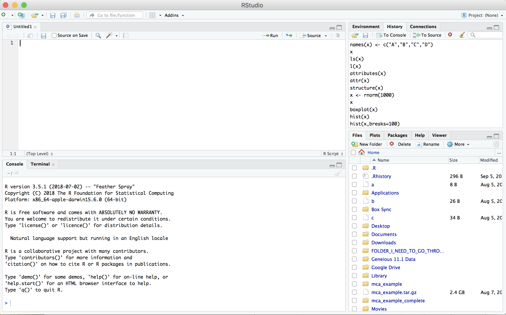
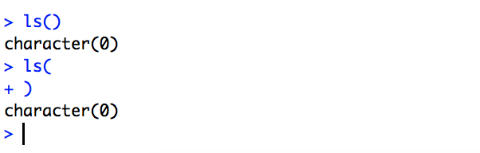

## What is R?
[R](http://r-project.org/) is a language and environment for statistical computing and graphics developed in 1993. It provides a wide variety of statistical and graphical techniques (linear and nonlinear modeling, statistical tests, time series analysis, classification, clustering, ...), and is highly extensible, meaning that the user community can write new R tools. It is a GNU project (Free and Open Source).

The R language has its roots in the S language and environment which was developed at Bell Laboratories (formerly AT&T, now Lucent Technologies) by John Chambers and colleagues. R was created by Ross Ihaka and Robert Gentleman at the University of Auckland, New Zealand, and now, R is developed by the R Development Core Team, of which Chambers is a member. R is named partly after the first names of the first two R authors (Robert Gentleman and Ross Ihaka), and partly as a play on the name of S. R can be considered as a different implementation of S. There are some important differences, but much code written for S runs unaltered under R.

Some of R's strengths:
* The ease with which well-designed publication-quality plots can be produced, including mathematical symbols and formulae where needed. Great care has been taken over the defaults for the minor design choices in graphics, but the user retains full control.
* It compiles and runs on a wide variety of UNIX platforms and similar systems (including FreeBSD and Linux), Windows and MacOS.
* R can be extended (easily) via packages.
* R has its own LaTeX-like documentation format, which is used to supply comprehensive documentation, both on-line in a number of formats and in hardcopy.
* It has a vast community both in academia and in business.
* It's FREE!

### The R environment
R is an integrated suite of software facilities for data manipulation, calculation and graphical display. It includes

* an effective data handling and storage facility,
* a suite of operators for calculations on arrays, in particular matrices,
* a large, coherent, integrated collection of intermediate tools for data analysis,
* graphical facilities for data analysis and display either on-screen or on hardcopy, and
* a well-developed, and effective programming language which includes conditionals, loops, user-defined recursive functions and input and output facilities.

The term "environment" is intended to characterize it as a fully planned and coherent system, rather than an incremental accretion of very specific and inflexible tools, as is frequently the case with other data analysis software.

R, like S, is designed around a true computer language, and it allows users to add additional functionality by defining new functions. Much of the system is itself written in the R dialect of S, which makes it easy for users to follow the algorithmic choices made. For computationally-intensive tasks, C, C++ and Fortran code can be linked and called at run time. Advanced users can write C code to manipulate R objects directly.

Many users think of R as a statistics system. The R group prefers to think of it of an environment within which statistical techniques are implemented.

### The R Homepage
The R homepage has a wealth of information on it,

[R-project.org](http://r-project.org/)

On the homepage you can:
* Learn more about R
* Download R
* Get Documentation (official and user supplied)
* Get access to CRAN 'Comprehensive R archival network'

## RStudio

[RStudio](http://rstudio.org/) started in 2010, to offer R a more full featured integrated development environment (IDE) and modeled after matlabs IDE.

RStudio has many features:
* syntax highlighting
* code completion
* smart indentation
* "Projects"
* workspace browser and data viewer
* embedded plots
* Markdown notebooks, Sweave authoring and knitr with one click pdf or html
* runs on all platforms and over the web
* etc. etc. etc.

RStudio and its team have contributed to many R packages.[13] These include:

* Tidyverse – R packages for data science, including ggplot2, dplyr, tidyr, and purrr
* Shiny – An interactive web technology
* RMarkdown – Insert R code into markdown documents
* knitr – Dynamic reports combining R, TeX, Markdown & HTML
* packrat – Package dependency tool
* devtools – Package development tool

**1\.** Getting started

Let's start RStudio

**2\.** Open a new RScript File

File -> New File -> R Script

Then save the new empty file as Intro2R.R

File -> Save as -> Intro2R.R

**3\.** Basics of your environment

The R prompt is the '>' , when R is expecting more (command is not complete) you see a '+'

**4\.** Writing and running R commands

In the source editor (top left by default)
type

    getwd()

Then on the line Control + Enter (Linux/Windows), Command + Enter (Mac) to execute the line.

**5\.** The assignment operator ( <- ) vs equals ( = )

The assignment operator is used assign data to a variable

    x <- 1:10
    x
    ## [1]  1  2  3  4  5  6  7  8  9 10

In this case, the equal sign works as well

    x = 1:10
    x
    ## [1]  1  2  3  4  5  6  7  8  9 10

But you should **NEVER EVER DO THIS**

    1:10 -> x
    x
    ## [1]  1  2  3  4  5  6  7  8  9 10

The two act the same in most cases. The difference in assignment operators is clearer when you use them to set an argument value in a function call. For example:

    median(x = 1:10)
    x   
    ## Error: object 'x' not found

In this case, x is declared within the scope of the function, so it does not exist in the user workspace.

    median(x <- 1:10)
    x
    ## [1]  1  2  3  4  5  6  7  8  9 10

In this case, x is declared in the user workspace, so you can use it after the function call has been completed. There is a general preference among the R community for using <- for assignment (other than in function signatures)

**6\.** The RStudio Cheat Sheets

[rstudio-ide.pdf](https://github.com/rstudio/cheatsheets/raw/master/rstudio-ide.pdf)

spend 15m getting to know RStudio a little
