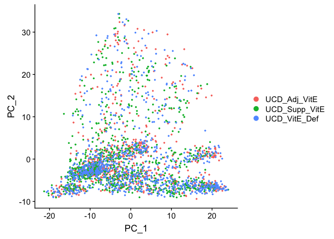
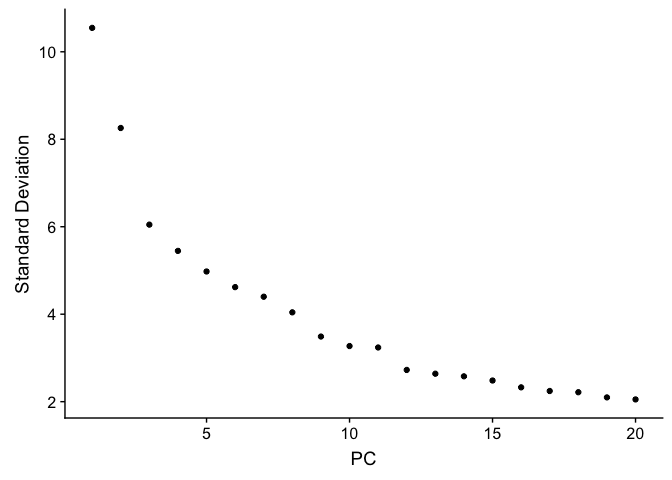
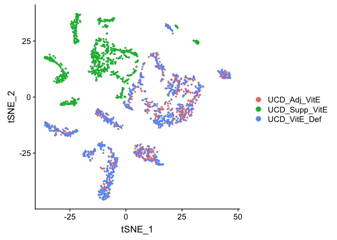
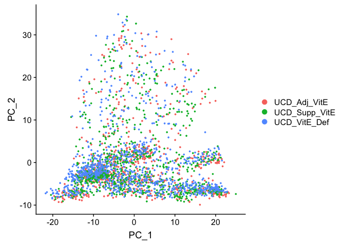
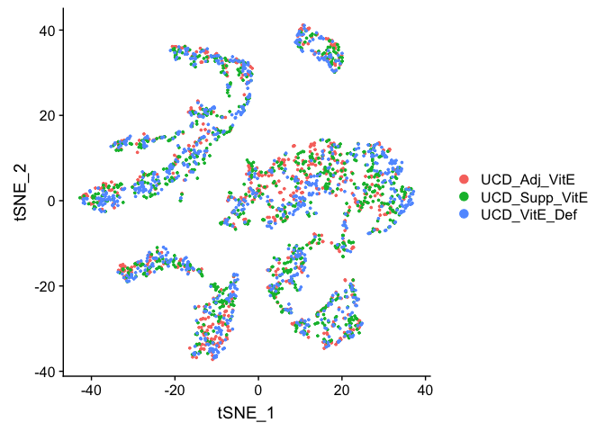
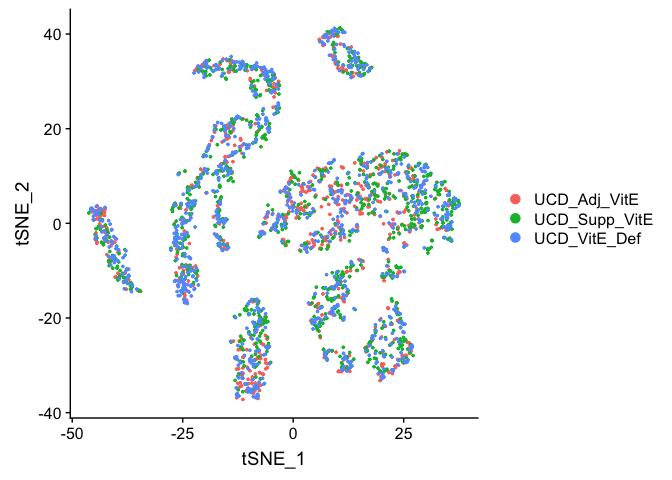

## Load libraries

```r
library(Seurat)
```

## Load the Seurat object

```r
load(file="pre_sample_corrected.RData")
experiment.aggregate
```

```
## An object of class Seurat 
## 12811 features across 2681 samples within 1 assay 
## Active assay: RNA (12811 features)
```

## Exploring Batch effects 3 ways, none, Seurat [vars.to.regress] and COMBAT

First lets view the data without any corrections

## PCA in prep for tSNE

ScaleData - Scales and centers genes in the dataset. 

```r
?ScaleData
experiment.aggregate.noc <- ScaleData(object = experiment.aggregate)
```

```
## Centering and scaling data matrix
```

### Run PCA

```r
experiment.aggregate.noc <- RunPCA(object = experiment.aggregate.noc)
```

```
## PC_ 1 
## Positive:  Txn1, Sncg, Fez1, S100a10, Atp6v0b, Lxn, Dctn3, Tppp3, Sh3bgrl3, Rabac1 
## 	   Cisd1, Ppia, Fxyd2, Atp6v1f, Stmn3, Ndufa11, Atp5g1, Bex2, Atpif1, Uchl1 
## 	   Ndufa4, Psmb6, Ubb, Hagh, Anxa2, Gabarapl2, Rgs10, Nme1, Prdx2, Psmb3 
## Negative:  Mt1, Malat1, Adcyap1, Ptn, Apoe, Zeb2, Mt2, Timp3, Fabp7, Gpm6b 
## 	   Gal, Kit, Qk, Atp2b4, Plp1, Ifitm3, 6330403K07Rik, Sparc, Id3, Gap43 
## 	   Selenop, Gpx3, Zfp36l1, Rgcc, Scg2, Cbfb, Zfp36, Igfbp7, Marcksl1, Phlda1 
## PC_ 2 
## Positive:  Nefh, Cntn1, Thy1, S100b, Sv2b, Cplx1, Slc17a7, Vamp1, Nefm, Lynx1 
## 	   Endod1, Atp1b1, Scn1a, Vsnl1, Nat8l, Ntrk3, Sh3gl2, Fam19a2, Eno2, Scn1b 
## 	   Spock1, Scn8a, Glrb, Syt2, Scn4b, Lrrn1, Lgi3, Atp2b2, Cpne6, Snap25 
## Negative:  Malat1, Cd24a, Tmem233, Cd9, Dusp26, Mal2, Tmem158, Carhsp1, Fxyd2, Ctxn3 
## 	   Prkca, Ubb, Arpc1b, Crip2, Gna14, S100a6, Cd44, Tmem45b, Klf5, Tceal9 
## 	   Hs6st2, Bex3, Cd82, Emp3, Ift122, Tubb2b, Pfn1, Fam89a, Dynll1, Acpp 
## PC_ 3 
## Positive:  P2ry1, Fam19a4, Gm7271, Rarres1, Th, Zfp521, Wfdc2, Tox3, Gfra2, D130079A08Rik 
## 	   Iqsec2, Pou4f2, Rgs5, Kcnd3, Id4, Rasgrp1, Slc17a8, Casz1, Cdkn1a, Piezo2 
## 	   Dpp10, Gm11549, Fxyd6, Spink2, Rgs10, Zfhx3, C1ql4, Cd34, Gabra1, Cckar 
## Negative:  Calca, Basp1, Gap43, Ppp3ca, Map1b, Scg2, Cystm1, Tmem233, Map7d2, Calm1 
## 	   Ift122, Tubb3, Ncdn, Resp18, Prkca, Etv1, Nmb, Skp1a, Crip2, Camk2a 
## 	   Epb41l3, Tspan8, Ntrk1, Gna14, Deptor, Adk, Jak1, Tmem255a, Etl4, Camk2g 
## PC_ 4 
## Positive:  Id3, Timp3, Selenop, Pvalb, Ifitm3, Sparc, Igfbp7, Adk, Tm4sf1, Sgk1 
## 	   Ly6c1, Id1, Etv1, Nsg1, Mt2, Slc17a7, Zfp36l1, Spp1, Cldn5, Itm2a 
## 	   Ier2, Aldoc, Shox2, Cxcl12, Ptn, Stxbp6, Qk, Sparcl1, Jak1, Slit2 
## Negative:  Gap43, Calca, Stmn1, Tac1, Ppp3ca, 6330403K07Rik, Arhgdig, Alcam, Adcyap1, Prune2 
## 	   Kit, Ngfr, Ywhag, Gal, Atp1a1, Fxyd6, Smpd3, Ntrk1, Tmem100, Mt3 
## 	   Atp2b4, Cd24a, Cnih2, Tppp3, Gpx3, S100a11, Scn7a, Snap25, Cbfb, Gnb1 
## PC_ 5 
## Positive:  Cpne3, Klf5, Acpp, Fxyd2, Jak1, Nppb, Osmr, Rgs4, Htr1f, Nbl1 
## 	   Gm525, Etv1, Sst, Zfhx3, Adk, Tspan8, Cysltr2, Parm1, Npy2r, Tmem233 
## 	   Nts, Cd24a, Prkca, Prune2, Socs2, Il31ra, Dgkz, Gnb1, Phf24, Plxnc1 
## Negative:  Mt1, Ptn, B2m, Prdx1, Dbi, Mt3, Ifitm3, Fxyd7, Id3, S100a16 
## 	   Calca, Mt2, Sparc, Pcp4l1, Selenop, Ifitm2, Rgcc, Igfbp7, Abcg2, Tm4sf1 
## 	   Selenom, S100a13, Apoe, Hspb1, Timp3, Cryab, Ubb, Ly6c1, Phlda1, Gap43
```

```r
DimPlot(object = experiment.aggregate.noc, reduction = "pca")
```



PCA Elbow plot to determine how many principal components to use in downstream analyses.  Components after the "elbow" in the plot generally explain little additional variability in the data.


```r
ElbowPlot(experiment.aggregate.noc)
```

<!-- -->

We use 10 components in downstream analyses. Using more components more closely approximates the full data set but increases run time.

### TSNE Plot

```r
pcs.use <- 10
experiment.aggregate.noc <- RunTSNE(object = experiment.aggregate.noc, dims = 1:pcs.use)
DimPlot(object = experiment.aggregate.noc)
```



## Correct for sample to sample differences (seurat)

Use vars.to.regress to correct for the sample to sample differences and percent mitochondria

```r
experiment.aggregate.regress <- ScaleData(object = experiment.aggregate, 
                    vars.to.regress = c("cell.cycle", "percent.mito"), model.use = "linear")
```

```
## Regressing out cell.cycle, percent.mito
```

```
## Centering and scaling data matrix
```

```r
experiment.aggregate.regress <- RunPCA(object =experiment.aggregate.regress)
```

```
## PC_ 1 
## Positive:  Txn1, Sncg, Fxyd2, Lxn, Fez1, Rgs10, S100a10, Synpr, Atp6v0b, Ppp1r1a 
## 	   Dctn3, Ubb, Tmem45b, Rabac1, Sh3bgrl3, Tppp3, Atpif1, Cisd1, Hagh, Bex2 
## 	   Atp6v1f, Bex3, Tmsb4x, Psmb6, Pfn1, Ndufa11, Aldoa, Anxa2, Ndufs5, Prr13 
## Negative:  Ptn, S100b, Cbfb, Mt1, Sv2b, Timp3, Ngfr, Nfia, Lynx1, Map2 
## 	   Adcyap1, Gap43, Fxyd7, Enah, Thy1, Nefh, Scg2, Syt2, Nptn, Tmem229b 
## 	   Faim2, Igfbp7, Kit, Epb41l3, Zeb2, Nfib, Slc17a7, Ryr2, Ncdn, Cntnap2 
## PC_ 2 
## Positive:  Cntn1, Nefh, Cplx1, Thy1, S100b, Slc17a7, Sv2b, Ntrk3, Atp1b1, Scn1a 
## 	   Vamp1, Nefm, Lrrn1, Atp2b2, Endod1, Hopx, Tagln3, Scn1b, Snap25, Vsnl1 
## 	   Nat8l, Nefl, Lynx1, Glrb, Scn4b, Fam19a2, Sh3gl2, Eno2, Scn8a, Cpne6 
## Negative:  Malat1, Tmem233, Cd9, Cd24a, Prkca, Mal2, Dusp26, Carhsp1, Gna14, Crip2 
## 	   Osmr, Tmem158, Ift122, Cd44, Gadd45g, Id3, Calca, Camk2a, Cd82, Hs6st2 
## 	   Ctxn3, Gm525, Emp3, S100a6, Nppb, Tac1, Socs2, Sst, Arpc1b, Crip1 
## PC_ 3 
## Positive:  P2ry1, Fam19a4, Gm7271, Rarres1, Th, Zfp521, Wfdc2, Tox3, Gfra2, Cdkn1a 
## 	   D130079A08Rik, Rgs5, Kcnd3, Iqsec2, Pou4f2, Cd34, Cd81, Slc17a8, Rasgrp1, Casz1 
## 	   Sorbs2, Id4, Dpp10, Piezo2, Zfhx3, Gm11549, Spink2, Gabra1, Igfbp7, Synpr 
## Negative:  Calca, Basp1, Map1b, Ppp3ca, Gap43, Cystm1, Scg2, Tubb3, Calm1, Map7d2 
## 	   Ncdn, Ift122, 6330403K07Rik, Epb41l3, Skp1a, Tmem233, Nmb, Dusp26, Tmem255a, Resp18 
## 	   Crip2, Ntrk1, Prkca, Tnfrsf21, Fxyd7, Ywhag, Deptor, Camk2a, Mt3, Camk2g 
## PC_ 4 
## Positive:  Adk, Etv1, Pvalb, Nsg1, Jak1, Tmem233, Tspan8, Nppb, Sst, Gm525 
## 	   Htr1f, Slc17a7, Shox2, Spp1, Slit2, Nts, Cbln2, Osmr, Stxbp6, Cmtm8 
## 	   Aldoc, Cysltr2, Runx3, Klf5, Fam19a2, Ptprk, Hapln4, Rasgrp2, Carhsp1, Atp1a3 
## Negative:  Gap43, Calca, Arhgdig, Stmn1, Tac1, 6330403K07Rik, Ngfr, Alcam, Kit, Ppp3ca 
## 	   Smpd3, Adcyap1, Fxyd6, Ntrk1, Atp1a1, Tagln3, Gal, Tmem100, Gm7271, Chl1 
## 	   Atp2b4, Mt3, Dclk1, S100a11, Fxyd7, Tppp3, Prune2, Cnih2, Fbxo2, Gng8 
## PC_ 5 
## Positive:  Fxyd2, Rgs4, Acpp, Cpne3, Zfhx3, Prune2, Klf5, Nbl1, Cd24a, Gnb1 
## 	   Phf24, Dgkz, Prkca, Parm1, Ywhag, Synpr, Tmem233, Kif5b, Osmr, Plxnc1 
## 	   Jak1, Dpp10, Ano3, Casz1, Tspan8, Rasgrp1, Arpc1b, P2ry1, Socs2, AC160336.1 
## Negative:  Mt1, Prdx1, Ptn, Dbi, B2m, Id3, Sparc, Mt2, Ifitm3, Ubb 
## 	   Selenop, Rgcc, Mt3, Timp3, Cryab, Apoe, Uqcrb, Hspa1a, Tecr, Phlda1 
## 	   Dad1, Fxyd7, Qk, Ier2, Ifitm2, Fxyd1, Spcs1, Selenom, Psmb2, Ndufa12
```

```r
DimPlot(object = experiment.aggregate.regress, reduction.use = "pca")
```



### Corrected TSNE Plot

```r
experiment.aggregate.regress <- RunTSNE(object = experiment.aggregate.regress, dims.use = 1:pcs.use)
DimPlot(object = experiment.aggregate.regress, reduction = "tsne")
```



## COMBAT corrected, https://academic.oup.com/biostatistics/article-lookup/doi/10.1093/biostatistics/kxj037


```r
library(sva)
```

```
## Loading required package: mgcv
```

```
## Loading required package: nlme
```

```
## This is mgcv 1.8-28. For overview type 'help("mgcv-package")'.
```

```
## Loading required package: genefilter
```

```
## Loading required package: BiocParallel
```

```r
?ComBat
m = as.matrix(GetAssayData(experiment.aggregate))
com = ComBat(dat=m, batch=as.numeric(as.factor(experiment.aggregate$orig.ident)), prior.plots=FALSE, par.prior=TRUE)
```

```
## Found3batches
```

```
## Adjusting for0covariate(s) or covariate level(s)
```

```
## Standardizing Data across genes
```

```
## Fitting L/S model and finding priors
```

```
## Finding parametric adjustments
```

```
## Adjusting the Data
```


```r
experiment.aggregate.combat <- experiment.aggregate
SetAssayData(experiment.aggregate.combat, new.data = as.matrix(com))
```

```
## An object of class Seurat 
## 12811 features across 2681 samples within 1 assay 
## Active assay: RNA (12811 features)
```

```r
experiment.aggregate.combat = ScaleData(experiment.aggregate.combat)
```

```
## Centering and scaling data matrix
```

### Principal components on ComBat adjusted data

```r
experiment.aggregate.combat <- RunPCA(object = experiment.aggregate.combat)
```

```
## PC_ 1 
## Positive:  Txn1, Sncg, Fez1, S100a10, Atp6v0b, Lxn, Dctn3, Tppp3, Sh3bgrl3, Rabac1 
## 	   Cisd1, Ppia, Fxyd2, Atp6v1f, Stmn3, Ndufa11, Atp5g1, Bex2, Atpif1, Uchl1 
## 	   Ndufa4, Psmb6, Ubb, Hagh, Anxa2, Gabarapl2, Rgs10, Nme1, Prdx2, Psmb3 
## Negative:  Mt1, Malat1, Adcyap1, Ptn, Apoe, Zeb2, Mt2, Timp3, Fabp7, Gpm6b 
## 	   Gal, Kit, Qk, Atp2b4, Plp1, Ifitm3, 6330403K07Rik, Sparc, Id3, Gap43 
## 	   Selenop, Gpx3, Zfp36l1, Rgcc, Scg2, Cbfb, Zfp36, Igfbp7, Marcksl1, Phlda1 
## PC_ 2 
## Positive:  Nefh, Cntn1, Thy1, S100b, Sv2b, Cplx1, Slc17a7, Vamp1, Nefm, Lynx1 
## 	   Endod1, Atp1b1, Scn1a, Vsnl1, Nat8l, Ntrk3, Sh3gl2, Fam19a2, Eno2, Scn1b 
## 	   Spock1, Scn8a, Glrb, Syt2, Scn4b, Lrrn1, Lgi3, Atp2b2, Cpne6, Snap25 
## Negative:  Malat1, Cd24a, Tmem233, Cd9, Dusp26, Mal2, Tmem158, Carhsp1, Fxyd2, Ctxn3 
## 	   Prkca, Ubb, Arpc1b, Crip2, Gna14, S100a6, Cd44, Tmem45b, Klf5, Tceal9 
## 	   Hs6st2, Bex3, Cd82, Emp3, Ift122, Tubb2b, Pfn1, Fam89a, Dynll1, Acpp 
## PC_ 3 
## Positive:  P2ry1, Fam19a4, Gm7271, Rarres1, Th, Zfp521, Wfdc2, Tox3, Gfra2, D130079A08Rik 
## 	   Iqsec2, Pou4f2, Rgs5, Kcnd3, Id4, Rasgrp1, Slc17a8, Casz1, Cdkn1a, Piezo2 
## 	   Dpp10, Gm11549, Fxyd6, Spink2, Rgs10, Zfhx3, C1ql4, Cd34, Gabra1, Cckar 
## Negative:  Calca, Basp1, Gap43, Ppp3ca, Map1b, Scg2, Cystm1, Tmem233, Map7d2, Calm1 
## 	   Ift122, Tubb3, Ncdn, Resp18, Prkca, Etv1, Nmb, Skp1a, Crip2, Camk2a 
## 	   Epb41l3, Tspan8, Ntrk1, Gna14, Deptor, Adk, Jak1, Tmem255a, Etl4, Camk2g 
## PC_ 4 
## Positive:  Id3, Timp3, Selenop, Pvalb, Ifitm3, Sparc, Igfbp7, Adk, Tm4sf1, Sgk1 
## 	   Ly6c1, Id1, Etv1, Nsg1, Mt2, Slc17a7, Zfp36l1, Spp1, Cldn5, Itm2a 
## 	   Ier2, Aldoc, Shox2, Cxcl12, Ptn, Stxbp6, Qk, Sparcl1, Jak1, Slit2 
## Negative:  Gap43, Calca, Stmn1, Tac1, Ppp3ca, 6330403K07Rik, Arhgdig, Alcam, Adcyap1, Prune2 
## 	   Kit, Ngfr, Ywhag, Gal, Atp1a1, Fxyd6, Smpd3, Ntrk1, Tmem100, Mt3 
## 	   Atp2b4, Cd24a, Cnih2, Tppp3, Gpx3, S100a11, Scn7a, Snap25, Cbfb, Gnb1 
## PC_ 5 
## Positive:  Cpne3, Klf5, Acpp, Fxyd2, Jak1, Nppb, Osmr, Rgs4, Htr1f, Nbl1 
## 	   Gm525, Etv1, Sst, Zfhx3, Adk, Tspan8, Cysltr2, Parm1, Npy2r, Tmem233 
## 	   Nts, Cd24a, Prkca, Prune2, Socs2, Il31ra, Dgkz, Gnb1, Phf24, Plxnc1 
## Negative:  Mt1, Ptn, B2m, Prdx1, Dbi, Mt3, Ifitm3, Fxyd7, Id3, S100a16 
## 	   Calca, Mt2, Sparc, Pcp4l1, Selenop, Ifitm2, Rgcc, Igfbp7, Abcg2, Tm4sf1 
## 	   Selenom, S100a13, Apoe, Hspb1, Timp3, Cryab, Ubb, Ly6c1, Phlda1, Gap43
```

```r
DimPlot(object = experiment.aggregate.combat, reduction = "pca")
```


TSNE plot on ComBat adjusted data

```r
experiment.aggregate.combat <- RunTSNE(object = experiment.aggregate.combat, dims.use = 1:pcs.use)
DimPlot(object = experiment.aggregate.combat, reduction = "tsne")
```



#### Question(s)

1. Try a couple of PCA cutoffs (low and high) and compare the TSNE plots from the different methods.  Do they look meaningfully different?

## Get the next Rmd file

```r
download.file("https://raw.githubusercontent.com/ucdavis-bioinformatics-training/2019-single-cell-RNA-sequencing-Workshop-UCD_UCSF/master/scrnaseq_analysis/scRNA_Workshop-PART4.Rmd", "scRNA_Workshop-PART4.Rmd")
```

## Session Information

```r
sessionInfo()
```

```
## R version 3.6.0 (2019-04-26)
## Platform: x86_64-apple-darwin15.6.0 (64-bit)
## Running under: macOS Mojave 10.14.5
## 
## Matrix products: default
## BLAS:   /Library/Frameworks/R.framework/Versions/3.6/Resources/lib/libRblas.0.dylib
## LAPACK: /Library/Frameworks/R.framework/Versions/3.6/Resources/lib/libRlapack.dylib
## 
## locale:
## [1] en_US.UTF-8/en_US.UTF-8/en_US.UTF-8/C/en_US.UTF-8/en_US.UTF-8
## 
## attached base packages:
## [1] stats     graphics  grDevices utils     datasets  methods   base     
## 
## other attached packages:
## [1] sva_3.32.1          BiocParallel_1.18.0 genefilter_1.66.0  
## [4] mgcv_1.8-28         nlme_3.1-140        Seurat_3.0.2       
## 
## loaded via a namespace (and not attached):
##   [1] tsne_0.1-3           matrixStats_0.54.0   bitops_1.0-6        
##   [4] bit64_0.9-7          RColorBrewer_1.1-2   httr_1.4.0          
##   [7] sctransform_0.2.0    tools_3.6.0          R6_2.4.0            
##  [10] irlba_2.3.3          KernSmooth_2.23-15   DBI_1.0.0           
##  [13] BiocGenerics_0.30.0  lazyeval_0.2.2       colorspace_1.4-1    
##  [16] npsurv_0.4-0         tidyselect_0.2.5     gridExtra_2.3       
##  [19] bit_1.1-14           compiler_3.6.0       Biobase_2.44.0      
##  [22] plotly_4.9.0         labeling_0.3         caTools_1.17.1.2    
##  [25] scales_1.0.0         lmtest_0.9-37        ggridges_0.5.1      
##  [28] pbapply_1.4-0        stringr_1.4.0        digest_0.6.19       
##  [31] rmarkdown_1.13       R.utils_2.9.0        pkgconfig_2.0.2     
##  [34] htmltools_0.3.6      bibtex_0.4.2         highr_0.8           
##  [37] limma_3.40.2         htmlwidgets_1.3      rlang_0.3.4         
##  [40] RSQLite_2.1.1        zoo_1.8-6            jsonlite_1.6        
##  [43] ica_1.0-2            gtools_3.8.1         dplyr_0.8.1         
##  [46] R.oo_1.22.0          RCurl_1.95-4.12      magrittr_1.5        
##  [49] Matrix_1.2-17        S4Vectors_0.22.0     Rcpp_1.0.1          
##  [52] munsell_0.5.0        ape_5.3              reticulate_1.12     
##  [55] R.methodsS3_1.7.1    stringi_1.4.3        yaml_2.2.0          
##  [58] gbRd_0.4-11          MASS_7.3-51.4        gplots_3.0.1.1      
##  [61] Rtsne_0.15           plyr_1.8.4           blob_1.1.1          
##  [64] grid_3.6.0           parallel_3.6.0       gdata_2.18.0        
##  [67] listenv_0.7.0        ggrepel_0.8.1        crayon_1.3.4        
##  [70] lattice_0.20-38      cowplot_0.9.4        splines_3.6.0       
##  [73] annotate_1.62.0      SDMTools_1.1-221.1   knitr_1.23          
##  [76] pillar_1.4.1         igraph_1.2.4.1       stats4_3.6.0        
##  [79] future.apply_1.3.0   reshape2_1.4.3       codetools_0.2-16    
##  [82] XML_3.98-1.20        glue_1.3.1           evaluate_0.14       
##  [85] lsei_1.2-0           metap_1.1            data.table_1.12.2   
##  [88] png_0.1-7            Rdpack_0.11-0        gtable_0.3.0        
##  [91] RANN_2.6.1           purrr_0.3.2          tidyr_0.8.3         
##  [94] future_1.13.0        assertthat_0.2.1     ggplot2_3.2.0       
##  [97] xfun_0.7             rsvd_1.0.1           xtable_1.8-4        
## [100] survival_2.44-1.1    viridisLite_0.3.0    tibble_2.1.3        
## [103] IRanges_2.18.1       memoise_1.1.0        AnnotationDbi_1.46.0
## [106] cluster_2.1.0        globals_0.12.4       fitdistrplus_1.0-14 
## [109] ROCR_1.0-7
```
