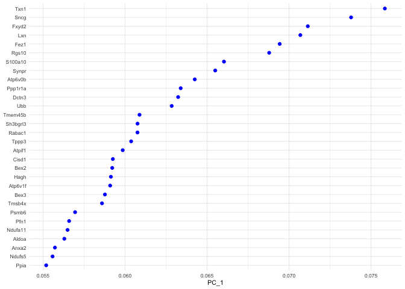
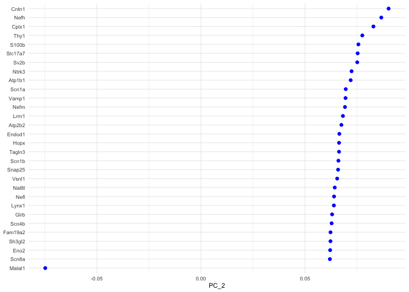
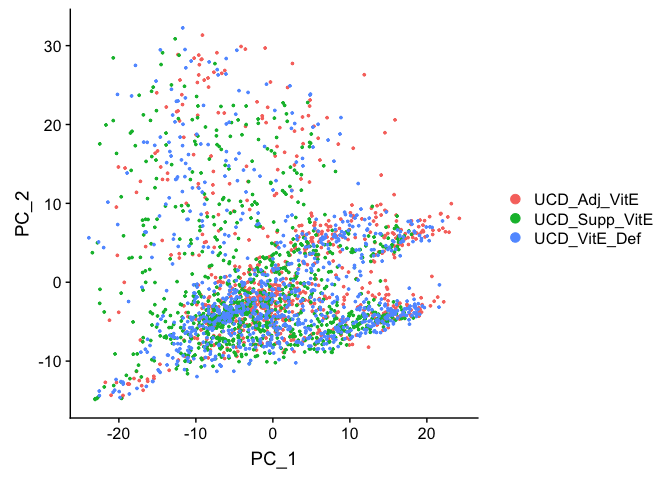
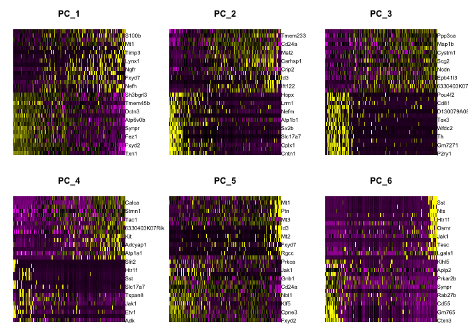
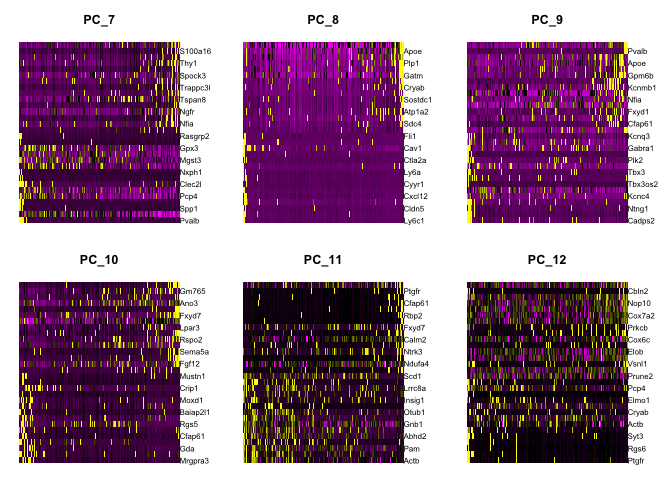
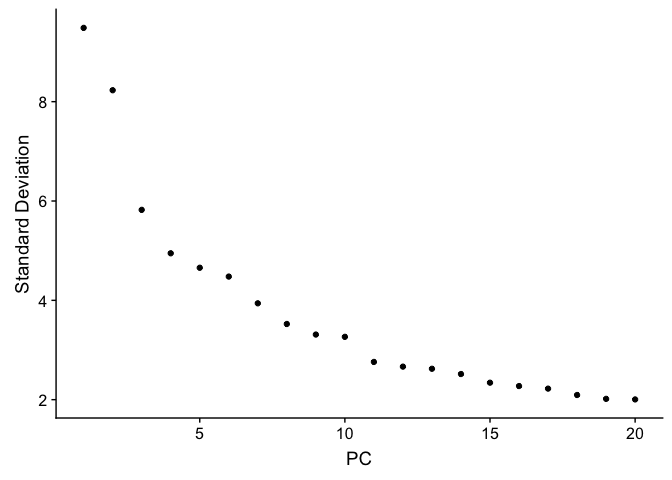
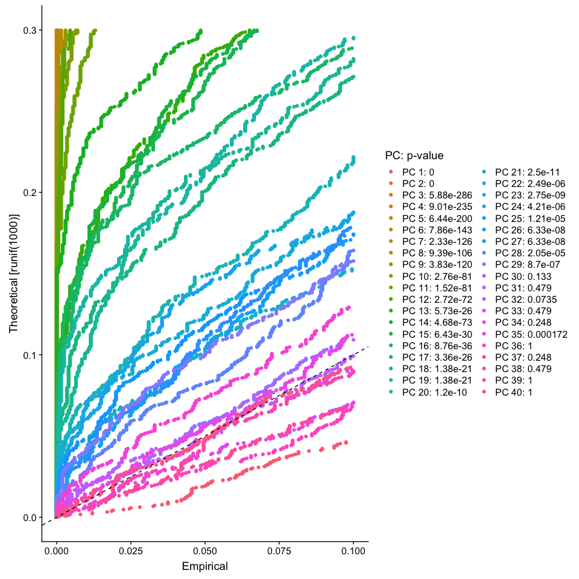

## Load libraries

```r
library(Seurat)
library(ggplot2)
```

## Load the Seurat object

```r
load(file="pre_sample_corrected.RData")
experiment.aggregate
```

```
## An object of class Seurat 
## 12811 features across 2681 samples within 1 assay 
## Active assay: RNA (12811 features)
```


## Now doing so for 'real'

ScaleData - Scales and centers genes in the dataset. If variables are provided in vars.to.regress, they are individually regressed against each gene, and the resulting residuals are then scaled and centered unless otherwise specified. Here we regress out for sample (orig.ident) and percentage mitochondria (percent.mito).


```r
?ScaleData
experiment.aggregate <- ScaleData(
  object = experiment.aggregate,
  vars.to.regress = c("cell.cycle", "percent.mito"))
```

```
## Regressing out cell.cycle, percent.mito
```

```
## Centering and scaling data matrix
```

## Dimensionality reduction with PCA

Next we perform PCA (principal components analysis) on the scaled data.  


```r
?RunPCA
experiment.aggregate <- RunPCA(object = experiment.aggregate, features = VariableFeatures(object = experiment.aggregate))
```

```
## PC_ 1 
## Positive:  Txn1, Sncg, Fxyd2, Lxn, Fez1, Rgs10, S100a10, Synpr, Atp6v0b, Ppp1r1a 
## 	   Dctn3, Ubb, Tmem45b, Sh3bgrl3, Rabac1, Tppp3, Atpif1, Cisd1, Hagh, Bex2 
## 	   Atp6v1f, Bex3, Tmsb4x, Psmb6, Pfn1, Ndufa11, Aldoa, Anxa2, Ndufs5, Ppia 
## Negative:  Ptn, S100b, Cbfb, Mt1, Sv2b, Timp3, Ngfr, Nfia, Adcyap1, Map2 
## 	   Lynx1, Gap43, Fxyd7, Enah, Thy1, Scg2, Nefh, Syt2, Nptn, Tmem229b 
## 	   Faim2, Igfbp7, Kit, Zeb2, Nfib, Epb41l3, Slc17a7, Ryr2, Ncdn, Cntnap2 
## PC_ 2 
## Positive:  Cntn1, Nefh, Cplx1, Thy1, S100b, Slc17a7, Sv2b, Ntrk3, Atp1b1, Scn1a 
## 	   Vamp1, Nefm, Lrrn1, Atp2b2, Endod1, Hopx, Tagln3, Scn1b, Snap25, Vsnl1 
## 	   Nat8l, Lynx1, Nefl, Glrb, Scn4b, Fam19a2, Sh3gl2, Scn8a, Eno2, Cpne6 
## Negative:  Malat1, Tmem233, Cd9, Cd24a, Prkca, Mal2, Dusp26, Carhsp1, Gna14, Crip2 
## 	   Osmr, Tmem158, Cd44, Ift122, Gadd45g, Id3, Calca, Camk2a, Cd82, Hs6st2 
## 	   Ctxn3, Gm525, Emp3, S100a6, Nppb, Tac1, Socs2, Sst, Arpc1b, Crip1 
## PC_ 3 
## Positive:  P2ry1, Fam19a4, Gm7271, Rarres1, Th, Zfp521, Wfdc2, Tox3, Gfra2, Cdkn1a 
## 	   D130079A08Rik, Rgs5, Kcnd3, Iqsec2, Pou4f2, Cd34, Cd81, Slc17a8, Rasgrp1, Casz1 
## 	   Sorbs2, Id4, Dpp10, Piezo2, Zfhx3, Gm11549, Spink2, Gabra1, Igfbp7, Synpr 
## Negative:  Calca, Basp1, Map1b, Ppp3ca, Gap43, Cystm1, Scg2, Tubb3, Calm1, Map7d2 
## 	   Ncdn, Ift122, Epb41l3, 6330403K07Rik, Skp1a, Tmem233, Nmb, Dusp26, Tmem255a, Resp18 
## 	   Crip2, Ntrk1, Prkca, Tnfrsf21, Fxyd7, Ywhag, Deptor, Camk2a, Mt3, Etl4 
## PC_ 4 
## Positive:  Adk, Etv1, Pvalb, Nsg1, Jak1, Tmem233, Tspan8, Nppb, Sst, Gm525 
## 	   Htr1f, Slc17a7, Shox2, Spp1, Slit2, Nts, Cbln2, Osmr, Stxbp6, Cmtm8 
## 	   Aldoc, Runx3, Cysltr2, Klf5, Fam19a2, Ptprk, Hapln4, Rasgrp2, Carhsp1, Atp1a3 
## Negative:  Gap43, Calca, Arhgdig, Stmn1, Tac1, 6330403K07Rik, Ngfr, Alcam, Kit, Ppp3ca 
## 	   Smpd3, Adcyap1, Fxyd6, Ntrk1, Atp1a1, Tagln3, Gal, Tmem100, Gm7271, Chl1 
## 	   Atp2b4, Dclk1, Mt3, S100a11, Fxyd7, Tppp3, Prune2, Fbxo2, Cnih2, Mgll 
## PC_ 5 
## Positive:  Fxyd2, Rgs4, Acpp, Cpne3, Zfhx3, Klf5, Prune2, Nbl1, Cd24a, Gnb1 
## 	   Phf24, Dgkz, Prkca, Parm1, Ywhag, Osmr, Tmem233, Synpr, Kif5b, Jak1 
## 	   Plxnc1, Dpp10, Tspan8, Casz1, Ano3, Rasgrp1, P2ry1, Arpc1b, Socs2, Nppb 
## Negative:  Mt1, Prdx1, Ptn, Dbi, B2m, Id3, Mt2, Sparc, Ifitm3, Ubb 
## 	   Selenop, Mt3, Rgcc, Timp3, Cryab, Apoe, Uqcrb, Phlda1, Hspa1a, Tecr 
## 	   Dad1, Fxyd7, Qk, Ier2, Ifitm2, Fxyd1, Spcs1, Selenom, Psmb2, Igfbp7
```

Seurat then provides a number of ways to visualize the PCA results

Visualize PCA loadings

```r
p <- VizDimLoadings(experiment.aggregate, dims = 1, ncol = 1)
p + theme_minimal(base_size = 8)
```

<!-- -->

```r
p <- VizDimLoadings(experiment.aggregate, dims = 2, ncol = 1)
p + theme_minimal(base_size = 8)
```

<!-- -->

Principal components plot

```r
DimPlot(
  object = experiment.aggregate, reduction = "pca")
```

<!-- -->

Draws a heatmap focusing on a principal component. Both cells and genes are sorted by their principal component scores. Allows for nice visualization of sources of heterogeneity in the dataset.


```r
DimHeatmap(object = experiment.aggregate, dims = 1:6, cells = 500, balanced = TRUE)
```

<!-- -->

```r
DimHeatmap(object = experiment.aggregate, dims = 7:12, cells = 500, balanced = TRUE)
```

<!-- -->

### Selecting which PCs to use
To overcome the extensive technical noise in any single gene, Seurat clusters cells based on their PCA scores, with each PC essentially representing a metagene that combines information across a correlated gene set. Determining how many PCs to include downstream is therefore an important step.

ElbowPlot plots the standard deviations (or approximate singular values if running PCAFast) of the principle components for easy identification of an elbow in the graph. This elbow often corresponds well with the significant PCs and is much faster to run.  This is the traditional approach to selecting principal components.


```r
ElbowPlot(experiment.aggregate)
```

<!-- -->

The JackStraw function randomly permutes a subset of data, and calculates projected PCA scores for these 'random' genes, then compares the PCA scores for the 'random' genes with the observed PCA scores to determine statistical signifance. End result is a p-value for each gene's association with each principal component. We identify significant PCs as those who have a strong enrichment of low p-value genes.

__WARNING: TAKES A LONG TIME TO RUN__

```r
experiment.aggregate <- JackStraw(
    object = experiment.aggregate, dims = 40)
```


```r
experiment.aggregate <- ScoreJackStraw(experiment.aggregate, dims = 1:40)
JackStrawPlot(object = experiment.aggregate, dims = 1:40)
```

<!-- -->

Looking at the results of the JackStraw plot, we determine to use the first 35 PCs

```r
use.pcs = 1:29
```

## Finally, lets save the filtered and normalized data

```r
save(experiment.aggregate, file="pca_sample_corrected.RData")
```

## Get the next Rmd file

```r
download.file("https://raw.githubusercontent.com/ucdavis-bioinformatics-training/2019-single-cell-RNA-sequencing-Workshop-UCD_UCSF/master/scrnaseq_analysis/scRNA_Workshop-PART5.Rmd", "scRNA_Workshop-PART5.Rmd")
```

## Session Information

```r
sessionInfo()
```

```
## R version 3.6.0 (2019-04-26)
## Platform: x86_64-apple-darwin15.6.0 (64-bit)
## Running under: macOS Mojave 10.14.5
## 
## Matrix products: default
## BLAS:   /Library/Frameworks/R.framework/Versions/3.6/Resources/lib/libRblas.0.dylib
## LAPACK: /Library/Frameworks/R.framework/Versions/3.6/Resources/lib/libRlapack.dylib
## 
## locale:
## [1] en_US.UTF-8/en_US.UTF-8/en_US.UTF-8/C/en_US.UTF-8/en_US.UTF-8
## 
## attached base packages:
## [1] stats     graphics  grDevices utils     datasets  methods   base     
## 
## other attached packages:
## [1] ggplot2_3.2.0 Seurat_3.0.2 
## 
## loaded via a namespace (and not attached):
##  [1] httr_1.4.0          tidyr_0.8.3         viridisLite_0.3.0  
##  [4] jsonlite_1.6        splines_3.6.0       lsei_1.2-0         
##  [7] R.utils_2.9.0       gtools_3.8.1        Rdpack_0.11-0      
## [10] assertthat_0.2.1    yaml_2.2.0          ggrepel_0.8.1      
## [13] globals_0.12.4      pillar_1.4.1        lattice_0.20-38    
## [16] reticulate_1.12     glue_1.3.1          digest_0.6.19      
## [19] RColorBrewer_1.1-2  SDMTools_1.1-221.1  colorspace_1.4-1   
## [22] cowplot_0.9.4       htmltools_0.3.6     Matrix_1.2-17      
## [25] R.oo_1.22.0         plyr_1.8.4          pkgconfig_2.0.2    
## [28] bibtex_0.4.2        tsne_0.1-3          listenv_0.7.0      
## [31] purrr_0.3.2         scales_1.0.0        RANN_2.6.1         
## [34] gdata_2.18.0        Rtsne_0.15          tibble_2.1.3       
## [37] withr_2.1.2         ROCR_1.0-7          pbapply_1.4-0      
## [40] lazyeval_0.2.2      survival_2.44-1.1   magrittr_1.5       
## [43] crayon_1.3.4        evaluate_0.14       R.methodsS3_1.7.1  
## [46] future_1.13.0       nlme_3.1-140        MASS_7.3-51.4      
## [49] gplots_3.0.1.1      ica_1.0-2           tools_3.6.0        
## [52] fitdistrplus_1.0-14 data.table_1.12.2   gbRd_0.4-11        
## [55] stringr_1.4.0       plotly_4.9.0        munsell_0.5.0      
## [58] cluster_2.1.0       irlba_2.3.3         compiler_3.6.0     
## [61] rsvd_1.0.1          caTools_1.17.1.2    rlang_0.3.4        
## [64] grid_3.6.0          ggridges_0.5.1      htmlwidgets_1.3    
## [67] igraph_1.2.4.1      labeling_0.3        bitops_1.0-6       
## [70] rmarkdown_1.13      npsurv_0.4-0        gtable_0.3.0       
## [73] codetools_0.2-16    reshape2_1.4.3      R6_2.4.0           
## [76] gridExtra_2.3       zoo_1.8-6           knitr_1.23         
## [79] dplyr_0.8.1         future.apply_1.3.0  KernSmooth_2.23-15 
## [82] metap_1.1           ape_5.3             stringi_1.4.3      
## [85] parallel_3.6.0      Rcpp_1.0.1          sctransform_0.2.0  
## [88] png_0.1-7           tidyselect_0.2.5    xfun_0.7           
## [91] lmtest_0.9-37
```
