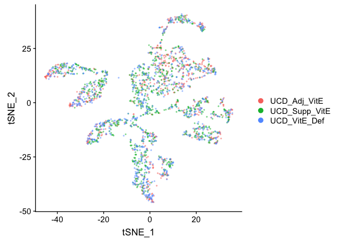

## Load libraries

```r
library(Seurat)
library(ggplot2)
```

## Load the Seurat object

```r
load(file="pca_sample_corrected.RData")
experiment.aggregate
```

```
## An object of class Seurat 
## 12811 features across 2681 samples within 1 assay 
## Active assay: RNA (12811 features)
##  1 dimensional reduction calculated: pca
```

## Identifying clusters

Seurat implements an graph-based clustering approach. Distances between the cells are calculated based on previously identified PCs. Seurat approach was heavily inspired by recent manuscripts which applied graph-based clustering approaches to scRNAseq data. Briefly, Seurat identify clusters of cells by a shared nearest neighbor (SNN) modularity optimization based clustering algorithm. First calculate k-nearest neighbors (KNN) and construct the SNN graph. Then optimize the modularity function to determine clusters. For a full description of the algorithms, see Waltman and van Eck (2013) The European Physical Journal B.

The FindClusters function implements the procedure, and contains a resolution parameter that sets the granularity of the downstream clustering, with increased values leading to a greater number of clusters. I tend to like to perform a series of resolutions, investigate and choose.


```r
use.pcs = 1:29 

experiment.aggregate <- FindNeighbors(experiment.aggregate, dims = use.pcs)
```

```
## Computing nearest neighbor graph
```

```
## Computing SNN
```

```r
experiment.aggregate <- FindClusters(
    object = experiment.aggregate, 
    resolution = seq(0.5,4,0.5), 
    verbose = FALSE
)
```

Lets first investigate how many clusters each resolution produces and set it to the smallest resolutions of 0.5 (fewest clusters). 


```r
sapply(grep("res",colnames(experiment.aggregate@meta.data),value = TRUE),
       function(x) length(unique(experiment.aggregate@meta.data[,x])))
```

```
## RNA_snn_res.0.5   RNA_snn_res.1 RNA_snn_res.1.5   RNA_snn_res.2 
##              14              16              20              25 
## RNA_snn_res.2.5   RNA_snn_res.3 RNA_snn_res.3.5   RNA_snn_res.4 
##              26              27              28              29
```

```r
Idents(experiment.aggregate) <- "RNA_snn_res.0.5"
```

Finally,  lets produce a table of cluster to sample assignments.

```r
table(Idents(experiment.aggregate),experiment.aggregate$orig.ident)
```

```
##     
##      UCD_Adj_VitE UCD_Supp_VitE UCD_VitE_Def
##   0           157           174          161
##   1           121           143          106
##   2            77           115          155
##   3            93            82           94
##   4            55            77           86
##   5            51            79           62
##   6            60            66           65
##   7            48            50           45
##   8            23            45           39
##   9            34            33           37
##   10           20            30           20
##   11           31            19           18
##   12           18            20           19
##   13           20            14           19
```

tSNE dimensionality reduction plots are then used to visualise clustering results. As input to the tSNE, you should use the same PCs as input to the clustering analysis.


```r
experiment.aggregate <- RunTSNE(
  object = experiment.aggregate,
  reduction.use = "pca",
  dims.use = use.pcs,
  do.fast = TRUE)
```

Plot TSNE coloring by the slot 'orig.ident' (sample names).

```r
DimPlot(object = experiment.aggregate, group.by="orig.ident", pt.size=0.5, reduction = "tsne" )
```

<!-- -->

```r
## Pretty tsne using alpha
p <- DimPlot(object = experiment.aggregate, group.by="orig.ident", pt.size=0.5, reduction = "tsne", do.return = T)
alpha.use <- 2/5
p$layers[[1]]$mapping$alpha <- alpha.use
p + scale_alpha_continuous(range = alpha.use, guide = F)
```

<!-- -->

Plot TSNE coloring by the slot 'ident' (default).

```r
DimPlot(object = experiment.aggregate, pt.size=0.5, reduction = "tsne", label = T)
```

<!-- -->


Plot TSNE coloring by the clustering resolution 4

```r
DimPlot(object = experiment.aggregate, group.by="RNA_snn_res.4", pt.size=0.5, do.label = TRUE, reduction = "tsne", label = T)
```

<!-- -->

FeaturePlot can be used to color cells with a 'feature', non categorical data, like number of UMIs

```r
FeaturePlot(experiment.aggregate, features = c('nCount_RNA'), pt.size=0.5)
```

<!-- -->
and number of genes present

```r
FeaturePlot(experiment.aggregate, features = c('nFeature_RNA'), pt.size=0.5)
```

<!-- -->

percent mitochondrial 

```r
FeaturePlot(experiment.aggregate, features = c('percent.mito'), pt.size=0.5)
```

<!-- -->

TSNE plot by cell cycle

```r
DimPlot(object = experiment.aggregate, pt.size=0.5, group.by = "cell.cycle", reduction = "tsne" )
```

<div class="figure" style="text-align: center">

<p class="caption">TSNE Plot by Cell Cycle, No Adjustment</p>
</div>


## Building  a  tree relating the 'average' cell from each cluster. Tree is estimated based on a distance matrix constructed in either gene expression space or PCA space.


```r
experiment.aggregate <- BuildClusterTree(
  experiment.aggregate, dims = use.pcs)

PlotClusterTree(experiment.aggregate)
```

<!-- -->


```r
DimPlot(object = experiment.aggregate, pt.size=0.5, label = TRUE, reduction = "tsne")
```

<!-- -->


```r
experiment.merged <- RenameIdents(
  object = experiment.aggregate,
  '1' = '0'
)
DimPlot(object = experiment.merged, pt.size=0.5, label = T, reduction = "tsne")
```

<!-- -->

## Identifying Marker Genes

Seurat can help you find markers that define clusters via differential expression.

`FindMarkers` identifies markers for a cluster relative to all other clusters.

`FindAllMarkers` does so for all clusters

`FindAllMarkersNode` defines all markers that split a Node __(Warning: need to validate)__


```r
?FindMarkers

markers = FindMarkers(experiment.merged, ident.1=c(10), genes.use = VariableFeatures(experiment.merged))

head(markers)
```

```
##                  p_val avg_logFC pct.1 pct.2     p_val_adj
## Baiap2l1 7.352739e-235 1.1954540 0.714 0.014 9.419593e-231
## Cadps2   4.448365e-198 2.3426788 0.971 0.051 5.698801e-194
## Tbx3os2  1.753416e-182 0.6699683 0.443 0.005 2.246301e-178
## Cbln2    1.849806e-152 1.1941476 0.786 0.038 2.369787e-148
## Ntng1    1.302871e-150 1.0795688 0.686 0.028 1.669108e-146
## Ntrk2    1.157467e-148 2.0506117 0.971 0.074 1.482831e-144
```

```r
dim(markers)
```

```
## [1] 1474    5
```

```r
table(markers$avg_logFC > 0)
```

```
## 
## FALSE  TRUE 
##   688   786
```

 
pct.1 and pct.2 are the proportion of cells with expression above 0 in ident.1 and ident.2 respectively. p_val is the raw p_value associated with the differntial expression test with adjusted value in p_val_adj. avg_logFC is the average log fold change difference between the two groups. 
 
avg_diff (lines 130, 193 and) appears to be the difference in log(x = mean(x = exp(x = x) - 1) + 1) between groups.  It doesn’t seem like this should work out to be the signed ratio of pct.1 to pct.2 so I must be missing something.  It doesn’t seem to be related at all to how the p-values are calculated so maybe it doesn’t matter so much, and the sign is probably going to be pretty robust to how expression is measured.

Can use a violin plot to visualize the expression pattern of some markers

```r
VlnPlot(object = experiment.merged, features = rownames(markers)[1:2], pt.size = 0.05)
```

<!-- -->

Or a feature plot

```r
FeaturePlot(
    experiment.merged, 
    head(rownames(markers), n=6), 
    cols = c("lightgrey", "blue"), 
    ncol = 2
)
```

<!-- -->

```r
FeaturePlot(    
    experiment.merged, 
    "Fxyd1", 
    cols = c("lightgrey", "blue") 
)
```

<!-- -->

FindAllMarkers can be used to automate the process across all genes.
__WARNING: TAKES A LONG TIME TO RUN__


```r
markers_all <- FindAllMarkers(
    object = experiment.merged, 
    only.pos = TRUE, 
    min.pct = 0.25, 
    thresh.use = 0.25
)
```

```
## Calculating cluster 0
```

```
## Calculating cluster 2
```

```
## Calculating cluster 3
```

```
## Calculating cluster 4
```

```
## Calculating cluster 5
```

```
## Calculating cluster 6
```

```
## Calculating cluster 7
```

```
## Calculating cluster 8
```

```
## Calculating cluster 9
```

```
## Calculating cluster 10
```

```
## Calculating cluster 11
```

```
## Calculating cluster 12
```

```
## Calculating cluster 13
```

```r
dim(markers_all)
```

```
## [1] 5943    7
```

```r
head(markers_all)
```

```
##                 p_val avg_logFC pct.1 pct.2     p_val_adj cluster    gene
## Tac1    1.311938e-250 1.8659209 0.878 0.386 1.680723e-246       0    Tac1
## Adcyap1 1.251056e-240 1.7624344 0.650 0.070 1.602727e-236       0 Adcyap1
## Celf4   1.757660e-233 1.5823726 0.871 0.377 2.251738e-229       0   Celf4
## Calca   1.840752e-225 1.3764535 0.929 0.366 2.358187e-221       0   Calca
## Gal     1.649118e-193 1.7748844 0.479 0.023 2.112685e-189       0     Gal
## Fgf13   6.012794e-192 0.9301681 0.968 0.837 7.702991e-188       0   Fgf13
```

```r
table(table(markers_all$gene))
```

```
## 
##    1    2    3    4    5    6    7 
## 1598  916  521  165   47    8    1
```

```r
markers_all_single <- markers_all[markers_all$gene %in% names(table(markers_all$gene))[table(markers_all$gene) == 1],]

dim(markers_all_single)
```

```
## [1] 1598    7
```

```r
table(table(markers_all_single$gene))
```

```
## 
##    1 
## 1598
```

```r
table(markers_all_single$cluster)
```

```
## 
##   0   2   3   4   5   6   7   8   9  10  11  12  13 
##  87 104  80 128 115 246 394  45  61 154  13  88  83
```

```r
head(markers_all_single)
```

```
##                 p_val avg_logFC pct.1 pct.2     p_val_adj cluster    gene
## Adcyap1 1.251056e-240  1.762434 0.650 0.070 1.602727e-236       0 Adcyap1
## Celf4   1.757660e-233  1.582373 0.871 0.377 2.251738e-229       0   Celf4
## Gal     1.649118e-193  1.774884 0.479 0.023 2.112685e-189       0     Gal
## Syt4    1.626846e-191  1.199886 0.939 0.773 2.084152e-187       0    Syt4
## Gpx3    4.876839e-150  1.431709 0.476 0.064 6.247718e-146       0    Gpx3
## Nrsn1   3.786220e-127  1.188237 0.780 0.451 4.850526e-123       0   Nrsn1
```

Plot a heatmap of genes by cluster for the top 5 marker genes per cluster

```r
library(dplyr)
```

```
## 
## Attaching package: 'dplyr'
```

```
## The following objects are masked from 'package:stats':
## 
##     filter, lag
```

```
## The following objects are masked from 'package:base':
## 
##     intersect, setdiff, setequal, union
```

```r
top5 <- markers_all_single %>% group_by(cluster) %>% top_n(5, avg_logFC)
dim(top5)
```

```
## [1] 65  7
```

```r
DoHeatmap(
    object = experiment.merged, 
    features = top5$gene
) 
```

```
## Warning in DoHeatmap(object = experiment.merged, features = top5$gene): The
## following features were omitted as they were not found in the scale.data
## slot for the RNA assay: Tusc2, mt-Nd5, Dusp15, Brap, Chd5, Syt4, Celf4
```

<!-- -->


```r
# Get expression of genes for cells in and out of each cluster
getGeneClusterMeans <- function(gene, cluster){
  x <- GetAssayData(experiment.merged)[gene,]
  m <- tapply(x, ifelse(Idents(experiment.merged) == cluster, 1, 0), mean)
  mean.in.cluster <- m[2]
  mean.out.of.cluster <- m[1]
  return(list(mean.in.cluster = mean.in.cluster, mean.out.of.cluster = mean.out.of.cluster))
}

## for sake of time only using first six (head)
means <- mapply(getGeneClusterMeans, head(markers_all[,"gene"]), head(markers_all[,"cluster"]))
means <- matrix(unlist(means), ncol = 2, byrow = T)

colnames(means) <- c("mean.in.cluster", "mean.out.of.cluster")
rownames(means) <- head(markers_all[,"gene"])
markers_all2 <- cbind(head(markers_all), means)
head(markers_all2)
```

```
##                 p_val avg_logFC pct.1 pct.2     p_val_adj cluster    gene
## Tac1    1.311938e-250 1.8659209 0.878 0.386 1.680723e-246       0    Tac1
## Adcyap1 1.251056e-240 1.7624344 0.650 0.070 1.602727e-236       0 Adcyap1
## Celf4   1.757660e-233 1.5823726 0.871 0.377 2.251738e-229       0   Celf4
## Calca   1.840752e-225 1.3764535 0.929 0.366 2.358187e-221       0   Calca
## Gal     1.649118e-193 1.7748844 0.479 0.023 2.112685e-189       0     Gal
## Fgf13   6.012794e-192 0.9301681 0.968 0.837 7.702991e-188       0   Fgf13
##         mean.in.cluster mean.out.of.cluster
## Tac1           2.729993          0.70246251
## Adcyap1        1.478343          0.10962330
## Celf4          2.352024          0.62001897
## Calca          3.199827          0.92791771
## Gal            1.109180          0.03420652
## Fgf13          3.366151          2.15037813
```

## Finishing up clusters.

At this point in time you should use the tree, markers, domain knowledge, and goals to finalize your clusters. This may mean adjusting PCA to use, mergers clusters together, choosing a new resolutions, etc. When finished you can further name it cluster by something more informative. Ex.

```r
experiment.clusters <- experiment.merged
experiment.clusters <- RenameIdents(
  object = experiment.clusters,
  '0' = 'cell_type_A'
)

DimPlot(object = experiment.clusters, pt.size=0.5, label = T, reduction = "tsne")
```

<!-- -->

```r
experiment.merged$finalcluster <- Idents(experiment.merged)
```

## Subsetting samples

```r
experiment.sample2 <- subset(experiment.merged, orig.ident == "UCD_Supp_VitE")

DimPlot(object = experiment.sample2, group.by = "RNA_snn_res.0.5", pt.size=0.5, label = TRUE, reduction = "tsne")
```

<!-- -->

```r
FeaturePlot(experiment.sample2, features =c('Calca'), pt.size=0.5)
```

<!-- -->

```r
FeaturePlot(experiment.sample2, features =c('Adcyap1'), pt.size=0.5)
```

<!-- -->

### Adding in a new metadata column representing samples within clusters


```r
experiment.merged$samplecluster = paste(experiment.merged$orig.ident,experiment.merged$finalcluster,sep = '-')

# set the identity to the new variable 
Idents(experiment.merged) <- "samplecluster"

markers.comp <- FindMarkers(experiment.merged, ident.1 = "UCD_Adj_VitE-0", ident.2= c("UCD_Supp_VitE-0","UCD_VitE_Def-0"))

markers.comp
```

```
##                      p_val  avg_logFC pct.1 pct.2    p_val_adj
## Car8          1.282944e-14  0.3948833 0.162 0.021 1.643579e-10
## Tmsb10        2.666894e-14  0.2972597 0.978 0.916 3.416558e-10
## Rpl21         1.720593e-10  0.3510050 0.917 0.740 2.204251e-06
## Rpl23a        1.890311e-10  0.2982967 0.928 0.755 2.421678e-06
## Rpl39         3.718969e-10  0.2725293 0.950 0.807 4.764371e-06
## Atp5e         6.685866e-09  0.3537328 0.669 0.455 8.565263e-05
## Pcp4          1.707987e-07  0.4676306 0.601 0.430 2.188102e-03
## S100a10       3.704062e-07  0.2710255 0.709 0.491 4.745274e-03
## Mt3           8.283434e-07  0.2548873 0.899 0.755 1.061191e-02
## Rps26         1.101874e-06  0.2724771 0.831 0.647 1.411611e-02
## Ndufa3        1.224526e-06  0.2614552 0.507 0.315 1.568740e-02
## Wdr89         1.670879e-06  0.2535288 0.237 0.108 2.140563e-02
## Ndufv3        2.278942e-06  0.2697308 0.727 0.538 2.919552e-02
## Fxyd7         2.298629e-06  0.3032798 0.558 0.375 2.944774e-02
## 1810058I24Rik 3.399248e-06  0.2683244 0.514 0.330 4.354777e-02
## Actb          4.385435e-06 -0.3941914 0.989 0.973 5.618181e-02
## Acbd5         1.443570e-05  0.2577780 0.385 0.241 1.849358e-01
## S100a11       2.250754e-05  0.2939947 0.475 0.317 2.883441e-01
## Wdfy1         5.303404e-04 -0.3353172 0.072 0.154 1.000000e+00
## Polr2f        5.974018e-04  0.2880090 0.234 0.142 1.000000e+00
## Gpx3          6.732207e-04  0.2550064 0.568 0.432 1.000000e+00
## Necab1        9.190603e-04 -0.4100914 0.194 0.284 1.000000e+00
## Kansl1        9.867037e-04  0.2540027 0.165 0.089 1.000000e+00
## Chchd10       3.767015e-03  0.2608603 0.165 0.098 1.000000e+00
## Arf3          8.963832e-03 -0.3305082 0.543 0.550 1.000000e+00
## Ptgir         2.258065e-02 -0.2640219 0.072 0.120 1.000000e+00
## Etv5          3.236398e-02 -0.3235883 0.169 0.221 1.000000e+00
## Rnf146        3.432618e-02 -0.2738134 0.079 0.125 1.000000e+00
## Tspan3        3.442117e-02 -0.2514633 0.194 0.252 1.000000e+00
## Vdac1         5.205770e-02 -0.3015605 0.414 0.425 1.000000e+00
## Aplp2         6.445553e-02 -0.2930104 0.604 0.563 1.000000e+00
## Cbx3          6.446826e-02 -0.2608676 0.342 0.375 1.000000e+00
## Ist1          7.226933e-02 -0.2584460 0.094 0.134 1.000000e+00
## Cct7          9.422990e-02 -0.2540971 0.155 0.193 1.000000e+00
## Vim           1.048422e-01 -0.2904123 0.151 0.188 1.000000e+00
## Dync1li1      1.203296e-01 -0.2806179 0.212 0.240 1.000000e+00
## Usp22         1.223358e-01 -0.2744823 0.288 0.310 1.000000e+00
## Rapgef4       1.274086e-01 -0.2784728 0.165 0.199 1.000000e+00
## Nacc2         1.372435e-01 -0.2898637 0.349 0.354 1.000000e+00
## Amer2         1.403407e-01 -0.2631879 0.158 0.188 1.000000e+00
## Eno2          1.607022e-01 -0.2703198 0.302 0.325 1.000000e+00
## Fgfr1         1.609611e-01 -0.2652481 0.119 0.147 1.000000e+00
## Gng5          1.774391e-01 -0.2668165 0.173 0.202 1.000000e+00
## Gpsm3         1.783213e-01 -0.2518827 0.119 0.146 1.000000e+00
## Lix1          1.882788e-01 -0.2648763 0.076 0.101 1.000000e+00
## Bhlhe41       1.954978e-01 -0.2779008 0.410 0.420 1.000000e+00
## Hdlbp         2.170926e-01 -0.2748920 0.097 0.120 1.000000e+00
## Lpar1         2.516716e-01 -0.2568538 0.086 0.108 1.000000e+00
## Alkbh5        2.675575e-01 -0.2910363 0.183 0.205 1.000000e+00
## Clasp2        2.691110e-01 -0.2654779 0.187 0.205 1.000000e+00
## Sult4a1       3.099188e-01 -0.2654949 0.529 0.486 1.000000e+00
## Nrn1          3.321550e-01 -0.2590242 0.406 0.392 1.000000e+00
## Tspan2        4.152282e-01 -0.2532937 0.183 0.192 1.000000e+00
## Setd3         5.103898e-01 -0.2745663 0.241 0.238 1.000000e+00
## Abhd2         5.205543e-01 -0.3486121 0.410 0.390 1.000000e+00
## Serinc5       5.837046e-01 -0.2509162 0.252 0.248 1.000000e+00
## Spry2         7.123013e-01 -0.2944266 0.191 0.190 1.000000e+00
## Pam           7.167790e-01 -0.5311357 0.576 0.519 1.000000e+00
## Nuak1         8.371852e-01 -0.2790992 0.173 0.166 1.000000e+00
## Rgs4          8.882279e-01 -0.2650778 0.457 0.423 1.000000e+00
```

```r
DoHeatmap(experiment.merged,
          cells = rownames(experiment.merged@meta.data)[experiment.merged@meta.data$samplecluster %in% c( "UCD_Adj_VitE-0", "UCD_Supp_VitE-0" )],
          features = rownames(markers.comp),
          )
```

```
## Warning in DoHeatmap(experiment.merged,
## cells = rownames(experiment.merged@meta.data)
## [experiment.merged@meta.data$samplecluster %in% : The following features
## were omitted as they were not found in the scale.data slot for the RNA
## assay: Nuak1, Serinc5, Setd3, Tspan2, Sult4a1, Clasp2, Hdlbp, Gng5, Amer2,
## Usp22, Dync1li1, Vim, Cct7, Ist1, Vdac1, Tspan3, Rnf146, Arf3, Kansl1,
## Necab1, Polr2f, Wdfy1, Acbd5, 1810058I24Rik, Wdr89, Ndufa3, Rps26, Atp5e,
## Rpl39, Rpl23a, Rpl21, Tmsb10
```

<!-- -->

```r
Idents(experiment.merged) <- "finalcluster"
```

And last lets save all the objects in our session.

```r
save(list=ls(), file="clusters_seurat_object.RData")
```

## Get the next Rmd file

```r
download.file("https://raw.githubusercontent.com/ucdavis-bioinformatics-training/2019-single-cell-RNA-sequencing-Workshop-UCD_UCSF/master/scrnaseq_analysis/scRNA_Workshop-PART6.Rmd", "scRNA_Workshop-PART6.Rmd")
```

## Session Information

```r
sessionInfo()
```

```
## R version 3.6.0 (2019-04-26)
## Platform: x86_64-apple-darwin15.6.0 (64-bit)
## Running under: macOS Mojave 10.14.5
## 
## Matrix products: default
## BLAS:   /Library/Frameworks/R.framework/Versions/3.6/Resources/lib/libRblas.0.dylib
## LAPACK: /Library/Frameworks/R.framework/Versions/3.6/Resources/lib/libRlapack.dylib
## 
## locale:
## [1] en_US.UTF-8/en_US.UTF-8/en_US.UTF-8/C/en_US.UTF-8/en_US.UTF-8
## 
## attached base packages:
## [1] stats     graphics  grDevices utils     datasets  methods   base     
## 
## other attached packages:
## [1] dplyr_0.8.1   ggplot2_3.2.0 Seurat_3.0.2 
## 
## loaded via a namespace (and not attached):
##  [1] nlme_3.1-140        tsne_0.1-3          bitops_1.0-6       
##  [4] RColorBrewer_1.1-2  httr_1.4.0          sctransform_0.2.0  
##  [7] tools_3.6.0         R6_2.4.0            irlba_2.3.3        
## [10] KernSmooth_2.23-15  lazyeval_0.2.2      colorspace_1.4-1   
## [13] npsurv_0.4-0        withr_2.1.2         tidyselect_0.2.5   
## [16] gridExtra_2.3       compiler_3.6.0      plotly_4.9.0       
## [19] labeling_0.3        caTools_1.17.1.2    scales_1.0.0       
## [22] lmtest_0.9-37       ggridges_0.5.1      pbapply_1.4-0      
## [25] stringr_1.4.0       digest_0.6.19       rmarkdown_1.13     
## [28] R.utils_2.9.0       pkgconfig_2.0.2     htmltools_0.3.6    
## [31] bibtex_0.4.2        highr_0.8           htmlwidgets_1.3    
## [34] rlang_0.3.4         zoo_1.8-6           jsonlite_1.6       
## [37] ica_1.0-2           gtools_3.8.1        R.oo_1.22.0        
## [40] magrittr_1.5        Matrix_1.2-17       Rcpp_1.0.1         
## [43] munsell_0.5.0       ape_5.3             reticulate_1.12    
## [46] R.methodsS3_1.7.1   stringi_1.4.3       yaml_2.2.0         
## [49] gbRd_0.4-11         MASS_7.3-51.4       gplots_3.0.1.1     
## [52] Rtsne_0.15          plyr_1.8.4          grid_3.6.0         
## [55] parallel_3.6.0      gdata_2.18.0        listenv_0.7.0      
## [58] ggrepel_0.8.1       crayon_1.3.4        lattice_0.20-38    
## [61] cowplot_0.9.4       splines_3.6.0       SDMTools_1.1-221.1 
## [64] knitr_1.23          pillar_1.4.1        igraph_1.2.4.1     
## [67] future.apply_1.3.0  reshape2_1.4.3      codetools_0.2-16   
## [70] glue_1.3.1          evaluate_0.14       lsei_1.2-0         
## [73] metap_1.1           data.table_1.12.2   png_0.1-7          
## [76] Rdpack_0.11-0       gtable_0.3.0        RANN_2.6.1         
## [79] purrr_0.3.2         tidyr_0.8.3         future_1.13.0      
## [82] assertthat_0.2.1    xfun_0.7            rsvd_1.0.1         
## [85] survival_2.44-1.1   viridisLite_0.3.0   tibble_2.1.3       
## [88] cluster_2.1.0       globals_0.12.4      fitdistrplus_1.0-14
## [91] ROCR_1.0-7
```
