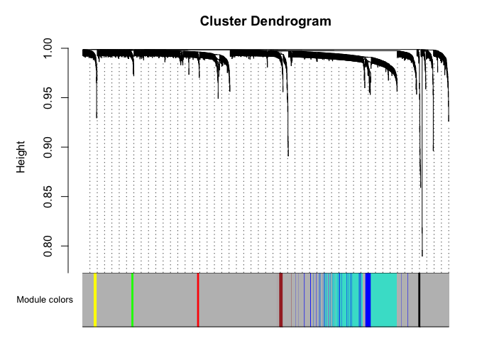
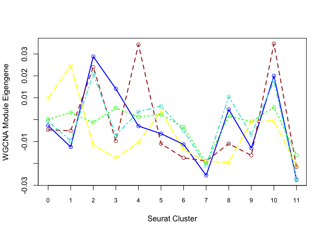
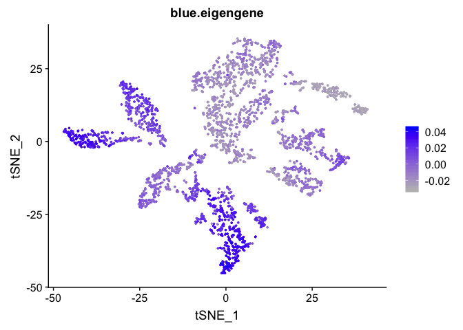

Reminder of samples

* UCD_Adj_VitE
* UCD_Supp_VitE
* UCD_VitE_Def

## Load libraries

```r
library(Seurat)
library(ggplot2)
```

## Load the Seurat object

```r
load("clusters_seurat_object.RData")
experiment.merged
```

```
## An object of class Seurat 
## 12811 features across 2681 samples within 1 assay 
## Active assay: RNA (12811 features)
##  2 dimensional reductions calculated: pca, tsne
```

```r
Idents(experiment.merged) <- "RNA_snn_res.0.5"
```


#0. Setup
Load the final Seurat object, load libraries (also see additional required packages for each example)


#1. DE With Single Cell Data Using Limma
For differential expression using models more complex than those allowed by FindAllMarkers(), data from Seurat may be used in limma (https://www.bioconductor.org/packages/devel/bioc/vignettes/limma/inst/doc/usersguide.pdf)

We illustrate by comparing sample 1 to sample 2 within cluster 0:

```r
library(limma)
cluster0 <- subset(experiment.merged, idents = '0')
expr <- as.matrix(GetAssayData(cluster0))

# Filter out genes that are 0 for every cell in this cluster
bad <- which(rowSums(expr) == 0)
expr <- expr[-bad,]

mm <- model.matrix(~0 + orig.ident, data = cluster0@meta.data)
fit <- lmFit(expr, mm)  
head(coef(fit)) # means in each sample for each gene
```

```
##        orig.identUCD_Adj_VitE orig.identUCD_Supp_VitE orig.identUCD_VitE_Def
## Xkr4               0.00000000              0.00000000             0.01205985
## Sox17              0.00000000              0.01640103             0.00000000
## Mrpl15             0.08176912              0.03491121             0.09928512
## Lypla1             0.19102070              0.14113531             0.27421545
## Tcea1              0.20114933              0.20678820             0.19408342
## Rgs20              0.08977786              0.16413658             0.12434977
```

```r
contr <- makeContrasts(orig.identUCD_Supp_VitE - orig.identUCD_Adj_VitE, levels = colnames(coef(fit)))
tmp <- contrasts.fit(fit, contrasts = contr)
tmp <- eBayes(tmp)
topTable(tmp, sort.by = "P", n = 20) # top 20 DE genes
```

```
##             logFC    AveExpr         t      P.Value    adj.P.Val        B
## Rpl21  -0.7724848 2.14209018 -5.890378 7.159580e-09 0.0000851632 9.738313
## Rpl23a -0.6865649 2.16173396 -5.447342 8.100825e-08 0.0004817966 7.531265
## Pcp4   -0.8229684 1.93476081 -5.256214 2.197765e-07 0.0006546034 6.625881
## Rpl17  -0.6834796 2.01758975 -5.255904 2.201273e-07 0.0006546034 6.624435
## Tmsb10 -0.5450433 3.35838422 -5.050790 6.215190e-07 0.0014785938 5.684808
## Rpl24  -0.5851214 2.09652619 -4.725294 3.005267e-06 0.0053603951 4.262728
## H3f3b  -0.6036830 2.25676617 -4.714988 3.154499e-06 0.0053603951 4.219097
## Rpl39  -0.5342677 2.23529589 -4.415747 1.239149e-05 0.0184246007 2.990268
## Rps8   -0.5492130 2.51810086 -4.333518 1.780959e-05 0.0189443296 2.665539
## Ndufa3 -0.4830157 0.75072369 -4.325111 1.847651e-05 0.0189443296 2.632655
## Rpl32  -0.5540049 2.44843495 -4.323717 1.858932e-05 0.0189443296 2.627210
## Zfp467 -0.2498323 0.16203051 -4.317371 1.911156e-05 0.0189443296 2.602431
## Tshz2  -0.5507727 2.31127549 -4.247578 2.586002e-05 0.0236619148 2.332172
## Rps15  -0.5515529 1.97711264 -4.207744 3.067469e-05 0.0250844004 2.179746
## Tmsb4x -0.3744138 3.22966552 -4.200539 3.163228e-05 0.0250844004 2.152316
## Alkal2 -0.1394787 0.05421123 -4.180105 3.450525e-05 0.0256524996 2.074765
## Rpl10  -0.4858114 2.22403787 -4.042487 6.139313e-05 0.0429571322 1.561626
## Rps24  -0.5126108 1.51587449 -4.002111 7.247695e-05 0.0465589355 1.414108
## Rpl9   -0.4899921 2.44944433 -3.982811 7.842255e-05 0.0465589355 1.344080
## Dbpht2 -0.4185910 0.61581149 -3.975239 8.087904e-05 0.0465589355 1.316694
```
* logFC: log2 fold change (UCD_Supp_VitE/UCD_Adj_VitE)
* AveExpr: Average expression, in log2 counts per million, across all cells included in analysis (i.e. those in cluster 0)
* t: t-statistic, i.e. logFC divided by its standard error
* P.Value: Raw p-value from test that logFC differs from 0
* adj.P.Val: Benjamini-Hochberg false discovery rate adjusted p-value

The limma vignette linked above gives more detail on model specification.

# 2. Gene Ontology (GO) Enrichment of Genes Expressed in a Cluster

```r
library(topGO)
```

```
## Loading required package: BiocGenerics
```

```
## Loading required package: parallel
```

```
## 
## Attaching package: 'BiocGenerics'
```

```
## The following objects are masked from 'package:parallel':
## 
##     clusterApply, clusterApplyLB, clusterCall, clusterEvalQ, clusterExport, clusterMap, parApply, parCapply, parLapply, parLapplyLB, parRapply, parSapply, parSapplyLB
```

```
## The following object is masked from 'package:limma':
## 
##     plotMA
```

```
## The following objects are masked from 'package:stats':
## 
##     IQR, mad, sd, var, xtabs
```

```
## The following objects are masked from 'package:base':
## 
##     anyDuplicated, append, as.data.frame, basename, cbind, colnames, dirname, do.call, duplicated, eval, evalq, Filter, Find, get, grep, grepl, intersect, is.unsorted, lapply, Map, mapply, match, mget, order, paste, pmax, pmax.int, pmin, pmin.int, Position, rank, rbind, Reduce, rownames, sapply, setdiff, sort, table, tapply, union, unique, unsplit, which, which.max, which.min
```

```
## Loading required package: graph
```

```
## Loading required package: Biobase
```

```
## Welcome to Bioconductor
## 
##     Vignettes contain introductory material; view with 'browseVignettes()'. To cite Bioconductor, see 'citation("Biobase")', and for packages 'citation("pkgname")'.
```

```
## Loading required package: GO.db
```

```
## Loading required package: AnnotationDbi
```

```
## Loading required package: stats4
```

```
## Loading required package: IRanges
```

```
## Loading required package: S4Vectors
```

```
## 
## Attaching package: 'S4Vectors'
```

```
## The following object is masked from 'package:base':
## 
##     expand.grid
```

```
## 
```

```
## Loading required package: SparseM
```

```
## 
## Attaching package: 'SparseM'
```

```
## The following object is masked from 'package:base':
## 
##     backsolve
```

```
## 
## groupGOTerms: 	GOBPTerm, GOMFTerm, GOCCTerm environments built.
```

```
## 
## Attaching package: 'topGO'
```

```
## The following object is masked from 'package:IRanges':
## 
##     members
```

```r
# install org.Mm.eg.db from Bioconductor if not already installed (for mouse only)
cluster0 <- subset(experiment.merged, idents = '0')
expr <- as.matrix(GetAssayData(cluster0))
# Select genes that are expressed > 0 in at least 75% of cells (somewhat arbitrary definition)
n.gt.0 <- apply(expr, 1, function(x)length(which(x > 0)))
expressed.genes <- rownames(expr)[which(n.gt.0/ncol(expr) >= 0.75)]
all.genes <- rownames(expr)

# define geneList as 1 if gene is in expressed.genes, 0 otherwise
geneList <- ifelse(all.genes %in% expressed.genes, 1, 0)
names(geneList) <- all.genes

# Create topGOdata object
	GOdata <- new("topGOdata",
		ontology = "BP", # use biological process ontology
		allGenes = geneList,
		geneSelectionFun = function(x)(x == 1),
              annot = annFUN.org, mapping = "org.Mm.eg.db", ID = "symbol")
```

```
## 
## Building most specific GOs .....
```

```
## Loading required package: org.Mm.eg.db
```

```
## 
```

```
## 	( 10570 GO terms found. )
```

```
## 
## Build GO DAG topology ..........
```

```
## 	( 14604 GO terms and 34657 relations. )
```

```
## 
## Annotating nodes ...............
```

```
## 	( 11727 genes annotated to the GO terms. )
```

```r
# Test for enrichment using Fisher's Exact Test
	resultFisher <- runTest(GOdata, algorithm = "elim", statistic = "fisher")
```

```
## 
## 			 -- Elim Algorithm -- 
## 
## 		 the algorithm is scoring 2878 nontrivial nodes
## 		 parameters: 
## 			 test statistic: fisher
## 			 cutOff: 0.01
```

```
## 
## 	 Level 19:	1 nodes to be scored	(0 eliminated genes)
```

```
## 
## 	 Level 18:	1 nodes to be scored	(0 eliminated genes)
```

```
## 
## 	 Level 17:	1 nodes to be scored	(0 eliminated genes)
```

```
## 
## 	 Level 16:	6 nodes to be scored	(0 eliminated genes)
```

```
## 
## 	 Level 15:	15 nodes to be scored	(0 eliminated genes)
```

```
## 
## 	 Level 14:	32 nodes to be scored	(13 eliminated genes)
```

```
## 
## 	 Level 13:	73 nodes to be scored	(20 eliminated genes)
```

```
## 
## 	 Level 12:	110 nodes to be scored	(416 eliminated genes)
```

```
## 
## 	 Level 11:	180 nodes to be scored	(750 eliminated genes)
```

```
## 
## 	 Level 10:	256 nodes to be scored	(778 eliminated genes)
```

```
## 
## 	 Level 9:	325 nodes to be scored	(1419 eliminated genes)
```

```
## 
## 	 Level 8:	379 nodes to be scored	(1555 eliminated genes)
```

```
## 
## 	 Level 7:	453 nodes to be scored	(2045 eliminated genes)
```

```
## 
## 	 Level 6:	441 nodes to be scored	(2267 eliminated genes)
```

```
## 
## 	 Level 5:	323 nodes to be scored	(2327 eliminated genes)
```

```
## 
## 	 Level 4:	180 nodes to be scored	(2328 eliminated genes)
```

```
## 
## 	 Level 3:	83 nodes to be scored	(2974 eliminated genes)
```

```
## 
## 	 Level 2:	18 nodes to be scored	(3547 eliminated genes)
```

```
## 
## 	 Level 1:	1 nodes to be scored	(3547 eliminated genes)
```

```r
	GenTable(GOdata, Fisher = resultFisher, topNodes = 20, numChar = 60)
```

```
##         GO.ID                                                            Term Annotated Significant Expected  Fisher
## 1  GO:0006412                                                     translation       517          48     5.73 9.1e-19
## 2  GO:0002181                                         cytoplasmic translation        77          17     0.85 5.5e-18
## 3  GO:0000028                                ribosomal small subunit assembly        18           7     0.20 5.0e-10
## 4  GO:0000027                                ribosomal large subunit assembly        29           7     0.32 2.2e-08
## 5  GO:0097214          positive regulation of lysosomal membrane permeability         2           2     0.02 0.00012
## 6  GO:0000462 maturation of SSU-rRNA from tricistronic rRNA transcript (SS...        30           4     0.33 0.00032
## 7  GO:0006880                          intracellular sequestering of iron ion         3           2     0.03 0.00036
## 8  GO:0016198                                   axon choice point recognition         4           2     0.04 0.00072
## 9  GO:0061844 antimicrobial humoral immune response mediated by antimicrob...        17           3     0.19 0.00081
## 10 GO:0006605                                               protein targeting       230           9     2.55 0.00104
## 11 GO:0071635 negative regulation of transforming growth factor beta produ...         5           2     0.06 0.00119
## 12 GO:0002227                                innate immune response in mucosa         5           2     0.06 0.00119
## 13 GO:0007409                                                    axonogenesis       353          13     3.91 0.00151
## 14 GO:0002679                  respiratory burst involved in defense response         6           2     0.07 0.00178
## 15 GO:1902255 positive regulation of intrinsic apoptotic signaling pathway...         6           2     0.07 0.00178
## 16 GO:1905323                          telomerase holoenzyme complex assembly         6           2     0.07 0.00178
## 17 GO:1904667        negative regulation of ubiquitin protein ligase activity         7           2     0.08 0.00247
## 18 GO:0071637         regulation of monocyte chemotactic protein-1 production         7           2     0.08 0.00247
## 19 GO:0048588                                       developmental cell growth       213           8     2.36 0.00254
## 20 GO:0050808                                            synapse organization       371          11     4.11 0.00276
```
* Annotated: number of genes (out of all.genes) that are annotated with that GO term
* Significant: number of genes that are annotated with that GO term and meet our criteria for "expressed"
* Expected: Under random chance, number of genes that would be expected to be annotated with that GO term and meeting our criteria for "expressed"
* Fisher: (Raw) p-value from Fisher's Exact Test

#3. Weighted Gene Co-Expression Network Analysis (WGCNA)
WGCNA identifies groups of genes ("modules") with correlated expression.
WARNING: TAKES A LONG TIME TO RUN

```r
library(WGCNA)
```

```
## Loading required package: dynamicTreeCut
```

```
## Loading required package: fastcluster
```

```
## 
## Attaching package: 'fastcluster'
```

```
## The following object is masked from 'package:stats':
## 
##     hclust
```

```
## 
## Attaching package: 'WGCNA'
```

```
## The following object is masked from 'package:IRanges':
## 
##     cor
```

```
## The following object is masked from 'package:S4Vectors':
## 
##     cor
```

```
## The following object is masked from 'package:stats':
## 
##     cor
```

```r
options(stringsAsFactors = F)
datExpr <- t(as.matrix(GetAssayData(experiment.merged)))[,VariableFeatures(experiment.merged)]  # only use variable genes in analysis

net <- blockwiseModules(datExpr, power = 10,
  corType = "bicor", # use robust correlation
	networkType = "signed", minModuleSize = 10,
	reassignThreshold = 0, mergeCutHeight = 0.15,
	numericLabels = F, pamRespectsDendro = FALSE,
	saveTOMs = TRUE,
	saveTOMFileBase = "TOM",
	verbose = 3)
```

```
##  Calculating module eigengenes block-wise from all genes
##    Flagging genes and samples with too many missing values...
##     ..step 1
##  ..Working on block 1 .
##     TOM calculation: adjacency..
##     ..will not use multithreading.
## alpha: 1.000000
##      Fraction of slow calculations: 0.000000
##     ..connectivity..
##     ..matrix multiplication (system BLAS)..
##     ..normalization..
##     ..done.
##    ..saving TOM for block 1 into file TOM-block.1.RData
##  ....clustering..
##  ....detecting modules..
##  ....calculating module eigengenes..
##  ....checking kME in modules..
##      ..removing 67 genes from module 1 because their KME is too low.
##      ..removing 43 genes from module 3 because their KME is too low.
##      ..removing 2 genes from module 12 because their KME is too low.
##  ..merging modules that are too close..
##      mergeCloseModules: Merging modules whose distance is less than 0.15
## alpha: 1.000000
##        Calculating new MEs...
## alpha: 1.000000
```

```r
table(net$colors)
```

```
## 
##     black      blue     brown     green      grey       red turquoise    yellow 
##        11        80        21        12      1536        11       312        17
```

```r
# Convert labels to colors for plotting
mergedColors = net$colors
# Plot the dendrogram and the module colors underneath
plotDendroAndColors(net$dendrograms[[1]], mergedColors[net$blockGenes[[1]]],
"Module colors",
dendroLabels = FALSE, hang = 0.03,
addGuide = TRUE, guideHang = 0.05)
```

<!-- -->
Genes in grey module are unclustered.

What genes are in the "blue" module?

```r
colnames(datExpr)[net$colors == "blue"]
```

```
##  [1] "Lxn"           "Txn1"          "Grik1"         "Fez1"          "Tmem45b"       "Synpr"         "Tceal9"        "Ppp1r1a"       "Rgs10"         "Nrn1"          "Fxyd2"         "Ostf1"         "Lix1"          "Sncb"          "Paqr5"         "Bex3"          "Anxa5"         "Gfra2"         "Scg3"          "Ppm1j"         "Kcnab1"        "Kcnip4"        "Cadm1"         "Isl2"          "Pla2g7"        "Tppp3"         "Rgs4"         
## [28] "Tmsb4x"        "Unc119"        "Pmm1"          "Ccdc68"        "Rnf7"          "Prr13"         "Rsu1"          "Pmp22"         "Acpp"          "Kcnip2"        "Cdk15"         "Mrps6"         "Ebp"           "Hexb"          "Cdh11"         "Dapk2"         "Ano3"          "Pde6d"         "Snx7"          "Dtnbp1"        "Tubb2b"        "Nr2c2ap"       "Phf24"         "Rcan2"         "Fam241b"       "Pmvk"          "Slc25a4"      
## [55] "Zfhx3"         "Dgkz"          "Ndufv1"        "Ptrh1"         "1700037H04Rik" "Kif5b"         "Sae1"          "Sri"           "Cpne3"         "Dgcr6"         "Cisd3"         "Syt7"          "Lhfpl3"        "Dda1"          "Ppp1ca"        "Glrx3"         "Stoml1"        "Plagl1"        "Lbh"           "Degs1"         "AI413582"      "Car10"         "Tlx2"          "Parm1"         "March11"       "Cpe"
```

Each cluster is represented by a summary "eigengene".
Plot eigengenes for each non-grey module by clusters from Seurat:

```r
f <- function(module){
  eigengene <- unlist(net$MEs[paste0("ME", module)])
  means <- tapply(eigengene, Idents(experiment.merged), mean, na.rm = T)
  return(means)
}
modules <- c("blue", "brown", "green", "turquoise", "yellow")
plotdat <- sapply(modules, f)
matplot(plotdat, col = modules, type = "l", lwd = 2, xaxt = "n", xlab = "Seurat Cluster",
        ylab = "WGCNA Module Eigengene")
axis(1, at = 1:19, labels = 0:18, cex.axis = 0.8)
matpoints(plotdat, col = modules, pch = 21)
```

<!-- -->

Can also plot the module onto the tsne plot

```r
blue.eigengene <- unlist(net$MEs[paste0("ME", "blue")])
names(blue.eigengene) <- rownames(datExpr)
experiment.merged$blue.eigengene <- blue.eigengene
FeaturePlot(experiment.merged, features = "blue.eigengene", cols = c("grey", "blue"))
```

<!-- -->


## Get the next Rmd file

```r
download.file("https://raw.githubusercontent.com/ucdavis-bioinformatics-training/2019-single-cell-RNA-sequencing-Workshop-UCD_UCSF/master/scrnaseq_analysis/scRNA_Workshop-PART7.Rmd", "scRNA_Workshop-PART7.Rmd")
```

## Session Information

```r
sessionInfo()
```

```
## R version 3.6.0 (2019-04-26)
## Platform: x86_64-apple-darwin15.6.0 (64-bit)
## Running under: macOS Mojave 10.14.5
## 
## Matrix products: default
## BLAS:   /Library/Frameworks/R.framework/Versions/3.6/Resources/lib/libRblas.0.dylib
## LAPACK: /Library/Frameworks/R.framework/Versions/3.6/Resources/lib/libRlapack.dylib
## 
## locale:
## [1] en_US.UTF-8/en_US.UTF-8/en_US.UTF-8/C/en_US.UTF-8/en_US.UTF-8
## 
## attached base packages:
## [1] stats4    parallel  stats     graphics  grDevices utils     datasets  methods   base     
## 
## other attached packages:
##  [1] WGCNA_1.68            fastcluster_1.1.25    dynamicTreeCut_1.63-1 org.Mm.eg.db_3.8.2    topGO_2.36.0          SparseM_1.77          GO.db_3.8.2           AnnotationDbi_1.46.0  IRanges_2.18.1        S4Vectors_0.22.0      Biobase_2.44.0        graph_1.62.0          BiocGenerics_0.30.0   limma_3.40.2          ggplot2_3.2.0         Seurat_3.0.2         
## 
## loaded via a namespace (and not attached):
##   [1] backports_1.1.4       Hmisc_4.2-0           plyr_1.8.4            igraph_1.2.4.1        lazyeval_0.2.2        splines_3.6.0         listenv_0.7.0         robust_0.4-18         digest_0.6.19         foreach_1.4.4         htmltools_0.3.6       gdata_2.18.0          magrittr_1.5          checkmate_1.9.3       memoise_1.1.0         fit.models_0.5-14     cluster_2.1.0         doParallel_1.0.14     ROCR_1.0-7            globals_0.12.4       
##  [21] matrixStats_0.54.0    R.utils_2.9.0         colorspace_1.4-1      blob_1.1.1            rrcov_1.4-7           ggrepel_0.8.1         xfun_0.7              dplyr_0.8.1           crayon_1.3.4          jsonlite_1.6          impute_1.58.0         survival_2.44-1.1     zoo_1.8-6             iterators_1.0.10      ape_5.3               glue_1.3.1            gtable_0.3.0          future.apply_1.3.0    DEoptimR_1.0-8        scales_1.0.0         
##  [41] mvtnorm_1.0-11        DBI_1.0.0             bibtex_0.4.2          Rcpp_1.0.1            metap_1.1             viridisLite_0.3.0     htmlTable_1.13.1      reticulate_1.12       foreign_0.8-71        bit_1.1-14            rsvd_1.0.1            SDMTools_1.1-221.1    preprocessCore_1.46.0 Formula_1.2-3         tsne_0.1-3            htmlwidgets_1.3       httr_1.4.0            gplots_3.0.1.1        RColorBrewer_1.1-2    acepack_1.4.1        
##  [61] ica_1.0-2             pkgconfig_2.0.2       R.methodsS3_1.7.1     nnet_7.3-12           tidyselect_0.2.5      labeling_0.3          rlang_0.3.4           reshape2_1.4.3        munsell_0.5.0         tools_3.6.0           RSQLite_2.1.1         ggridges_0.5.1        evaluate_0.14         stringr_1.4.0         yaml_2.2.0            npsurv_0.4-0          knitr_1.23            bit64_0.9-7           fitdistrplus_1.0-14   robustbase_0.93-5    
##  [81] caTools_1.17.1.2      purrr_0.3.2           RANN_2.6.1            pbapply_1.4-0         future_1.13.0         nlme_3.1-140          R.oo_1.22.0           compiler_3.6.0        rstudioapi_0.10       plotly_4.9.0          png_0.1-7             lsei_1.2-0            tibble_2.1.3          pcaPP_1.9-73          stringi_1.4.3         lattice_0.20-38       Matrix_1.2-17         pillar_1.4.1          Rdpack_0.11-0         lmtest_0.9-37        
## [101] data.table_1.12.2     cowplot_0.9.4         bitops_1.0-6          irlba_2.3.3           gbRd_0.4-11           R6_2.4.0              latticeExtra_0.6-28   KernSmooth_2.23-15    gridExtra_2.3         codetools_0.2-16      MASS_7.3-51.4         gtools_3.8.1          assertthat_0.2.1      withr_2.1.2           sctransform_0.2.0     grid_3.6.0            rpart_4.1-15          tidyr_0.8.3           rmarkdown_1.13        Rtsne_0.15           
## [121] base64enc_0.1-3
```
