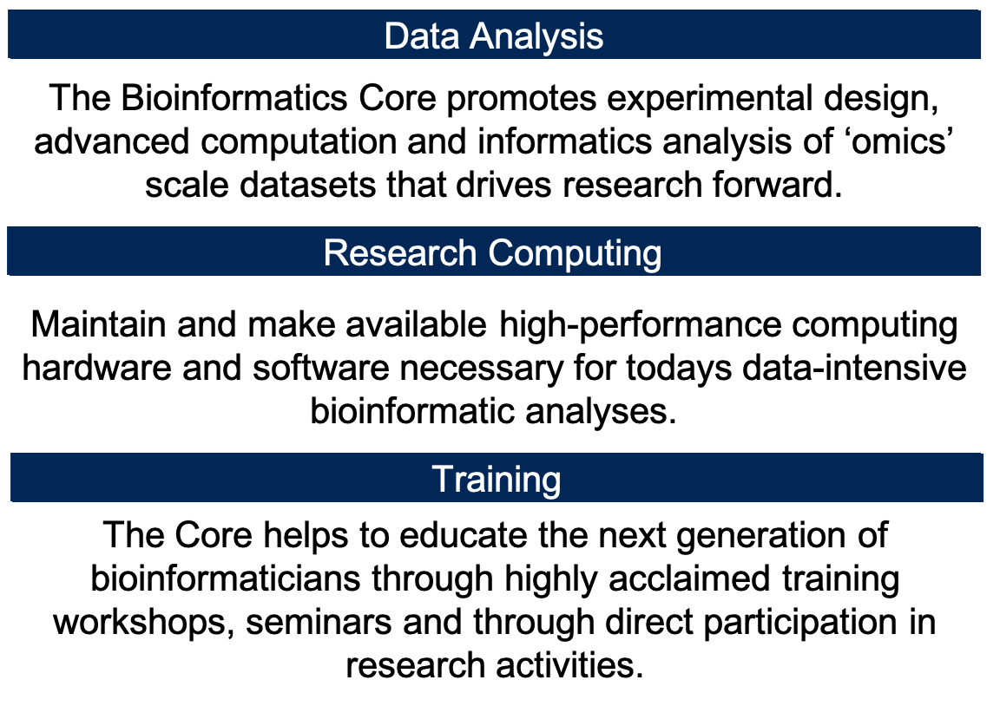
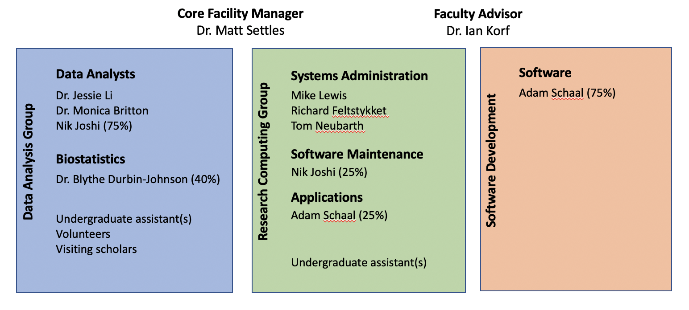

# Quick Introduction to the Workshop and Core

__The mission of the Bioinformatics Core facility is to facilitate outstanding omics-scale research through these activities:__

 

## Staff

 

## Contacts

* Bioinformatics related questions, include but not limited to bioinformatic methods questions, software use, data questions.
  * Bioinformatics.core@ucdavis.edu
* Computing Issues, include but not limited to user account questions, equipment failure/malfunction, software install, software failures (not related to use)
  * helpdesk@genomecenter.ucdavis.edu
* Training courses information
  * training.bioinformatics@ucdavis.edu

## Workshop Goals

* End to End understanding of scRNAseq Analysis
  * Discussions/lectures
  * Technologies
  * Experimental design
  * Cost estimation
  * Workflow
  * scRNA gene expression analysis
* To work through a complete experiment, starting from raw data to completion, including making a few figures.
* Goal is 30-40% lecture/discussion 60-70% hands-on

## Internet

### Eduroam
Many academic (and some non-academic) institutions are a part of Eduroam. (See "List of Institutions" under "Members" at https://www.eduroam.us/ to find out if your institution is a member.) Please make sure you can log into Eduroam with your device at your home institution, which will make things easier once you come to UCD/UCSF.

If your institution is not a member of Eduroam, you can still access the open wireless through ["UCD Guest"](#ucd-guest-wireless) or ["UCSF guest"](#ucsf-guest-wireless).

### UCD Guest Wireless

You will need to access the UCSF wireless via your laptop to participate in the hands-on exercises. Please review http://itcatalog.ucdavis.edu/service/wireless-guest-access	for access instructions.

### UCSF Guest Wireless

You will need to access the UCSF wireless via your laptop to participate in the hands-on exercises. Please review https://it.ucsf.edu/services/ucsfguest-open-wireless for access instructions.

## Workshop Materials

Workshop materials are all posted on github, and publicly available

http://bioinformatics.ucdavis.edu/training/events/

* Github main page:

	https://github.com/ucdavis-bioinformatics-training

* This scRNAseq Workshop

  https://ucdavis-bioinformatics-training.github.io/2019-single-cell-RNA-sequencing-Workshop-UCD_UCSF/

  https://github.com/ucdavis-bioinformatics-training/2019-single-cell-RNA-sequencing-Workshop-UCD_UCSF

## Computing Cluster

Course will be conducted on our servers and compute cluster .  
tadpole.genomecenter.ucdavis.edu

Everyone should get an account.  
https://computing.genomecenter.ucdavis.edu	 

Request an account -> sponsor "Bioinformatics Core Workshop"

If you already have an account on our system, then please do **NOT** create a new account and instead tell us your username and we will add you to the workshop.

This course does not utilize the cluster.

## Industry Sponsors Lunch and Learns and Wednesday (UCD) Social

### Lunch and Learns

* [10X Genomics](https://www.10xgenomics.com/)
* [Qiagen](https://www.qiagen.com/us/)
* [Celcee](https://www.celsee.com/)

### Wednesday Social @ UCD only

* [Illumina](https://www.illumina.com/)
